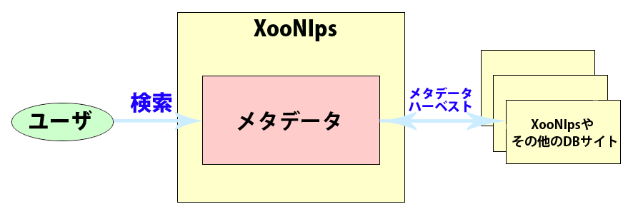

# 2.4. メタデータ

## 2.4.1. **メタデータを利用した他のデータベースサイトからの検索が可能** 

OAI-PMHに対応したデータベースサイトと連携が可能

* リポジトリ、ハーベスタどちらにもなることができます。
* メタデータ のフォーマット
  * 以下のフォーマットに対応：OAI-DC, JUNII, JUNII2

**Figure 1.6.**  **メタデータを利用した他DBからの検索**

