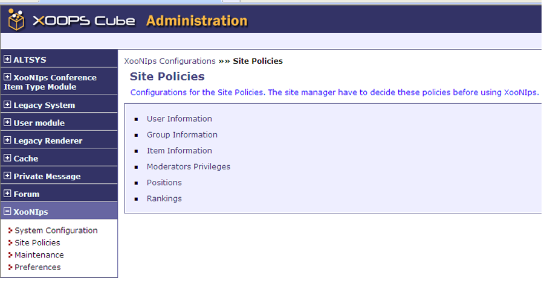
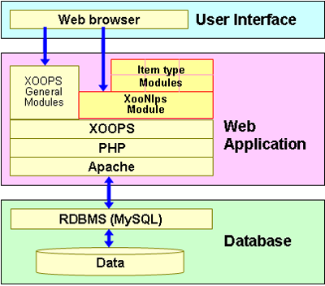

# 2.1. Flexible database construction

## 2.1.1. Set up the operation environment 

The site's operation environment, \(ex. manner of user registration and item publication, etc.\) can be easily set up by following the directions given on the Administration screen. You will simply choose the most appropriate one from the pulldown lists.

**Figure 1.1. Administration screen**

Examples:

* User registration
  * \[Certification by moderators\] \(The moderator will check the profile of the new user\).
  * \[Certify automatically\]
* Item publication
  * \[Certification by moderators\] \(The items will be peer reviewed\)
  * \[Certify automatically\]

## 2.1.2. Publication levels / areas for different purposes 

* Public
  * Public area: The items registered in this area will be publicized broadly to the public.
  * To register items in the public area, it is necessary to request for the site moderator's certification.
* Group
  * Group area: Access to this area is restricted to a group of registered users.
  * To register items and share them among the group, it is necessary to request for the group administrator's certification.
* Private
  * Individual area: registered users \(given a user ID and password\) can use this area just like a personal folder.

## 2.1.3. CMS XOOPS\(The base syste of XooNIps\) 

The following are the benefits from using XOOPS.

* Reduce the costs for system construction and operation.
  * XOOPS is open software \(enables free downloading\).
* Expand the functionality.
  * XOOPS modules offer wide varieties of site design.
* Allow to change visual effects easily.
  * XOOPS templates \(themes\) enable to easily change the visual effects such as layout, etc.

**Figure 1.2. XOOPS CMS Architecture**

