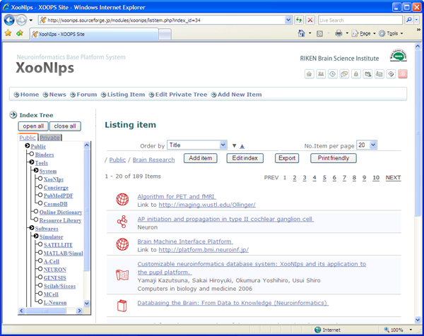

# 2.2. Data classification

## 2.2.1. Data classification by item type 

XooNIps is designed to support a variety of item types \(12 different data formats\). Besides, it provides advanced features to apply to emerging formats.

## 2.2.2. Index trees to classify / manage items 

The items will be organized by the Index Tree. The Index Tree consists of the following publication areas: Public, Group and Private. Each of the areas consists of keywords so that the items can be logically and effectively sorted.

**Figure 1.3. XooNIps**

## 2.2.3. Data search 

The following search options are available on XooNIps.

* Directory search by index trees
  * Choose an index tag \(public, group and private\) to view the item list.
* Keyword search
  * Choose a keyword at the default field.
* Detail search
  * Specify a search condition on each item type field.

