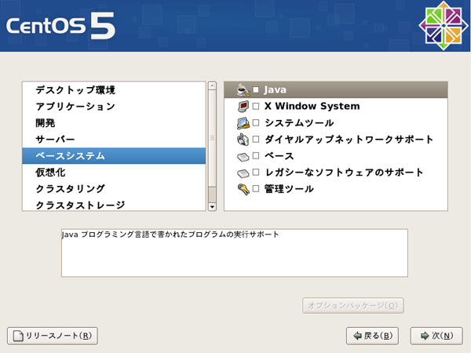
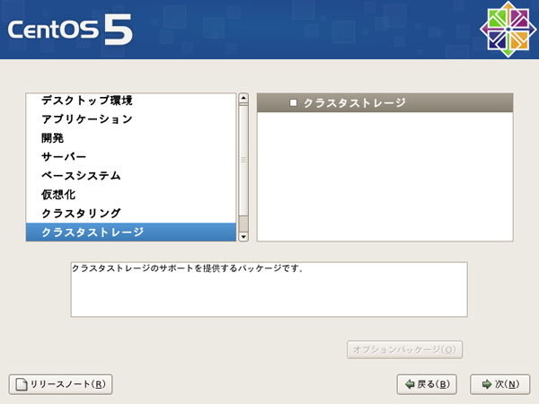

# 3.2. Procedure of installation

Insert a DVD into the computer to start installing

When "boot:" appears on the screen below, press **Enter**to go on to the next.

## 3.2.1. Media test 

Decide whether or not to test the media.

Press **Tab** key to move to \[Skip\]. Press **\[Enter\]** to go on to the next.

## 3.2.2. Graphical installation 

X Window System comes to run and the keyboard and mouse become active.

Click \[Next\] when the screen above appears.

## 3.2.3. Choose a language 

Choose a preferred language for instruction:

Choose "English \(English\)" if you prefer it.

Click on \[Next\] to go on to the next.

## 3.2.4. Set up for the keyboard 

Choose a type of keyboard:

Select the type of keyboard connected to the computer.

## 3.2.5. Initialization of the hard disk 

An alert message appears to ask whether or not to initialize the hard-disk.

Choose \[Yes\] to initialize the hard-disk.

## 3.2.6. Decide a partition 

Choose a partition to be installed Linux:

Choose \[Remove all partitions on selected drives and create default layout\].

Click on the \[Next\], and a warning message will appear.

Click on \[Yes\] to delete the partitions.

## 3.2.7. Set up for the network 

If there is DHCP server such as broadband router on the network, click on \[Next\].

If it is necessary to allocate an unchanging IP address; or there is no DHCP server on the network, click on \[Edit\].

Be sure to have the checkbox "Enable IPv4 support" checked.

Choose "Manual configuration".

Fill in the "IP address" and "Prefix \(Netmask\)", respectively.

Untick the checkbox of "Enable IPv6 support".

Click on \[OK\].

When it returns to the network device screen, input the hostname.

As shown in the dialog box, input \[hostname\].\[domain name\]

For example, `hostname.domainname.org`

Fill in the Gateway IP address at the "Gateway" field.

Fill in the IP address of DNS at the "Primary DNS" field.

Click on \[Next\].

## 3.2.8. Set up for time zone 

Set up the time zone. Click on a preferred location on the map or pulldown menu.

Untick \[System clock uses UTC\].

## 3.2.9. Set up for root password 

Set up a root password \(six characters or more\)

Be sure to remember the password. Make sure to distinguish between capital letters and small letters.

Asked to enter the password twice for confirmation.

Click on \[Next\].

## 3.2.10. Choose an install package 

Untick all the checkboxes.

Click on \[Customize now\] on the screen below and then \[Next\].

## 3.2.11. Choose an install package 2 

Choose "Desktop Environments" and untick the other checkboxes.

Choose "Applications", and untick the other checkboxes.

Choose "Development", and untick the other checkboxes.

Choose "Servers", and untick the other checkboxes.

Choose "Base System", and untick the other checkboxes.

Choose "Virtualization", and untick the other checkboxes.

Choose "Clustering", and untick the other checkboxes.

Choose "Cluster Storage", and untick the other checkboxes.

Choose "Languages", and check a preferred language.

Untick the others

Click on the \[Next\]

## 3.2.12. Package Install 

Click on \[Next\] on the following screen, and it will start installation.

The time required for the installation depends on the computer's performance.

## 3.2.13. Complete Installation 

When the screen shows as the following, take out the DVD and click on \[Restart\]

