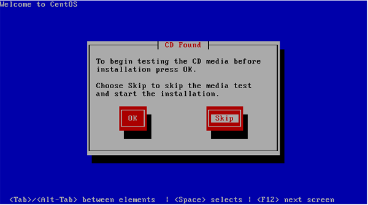
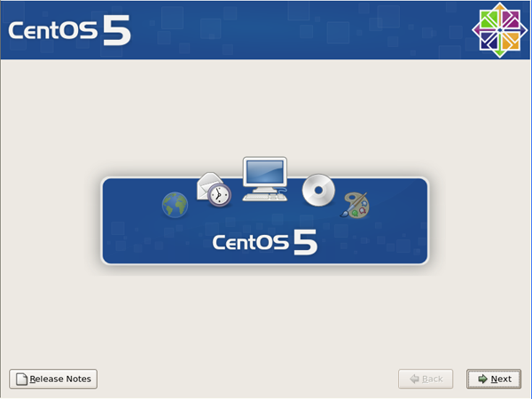
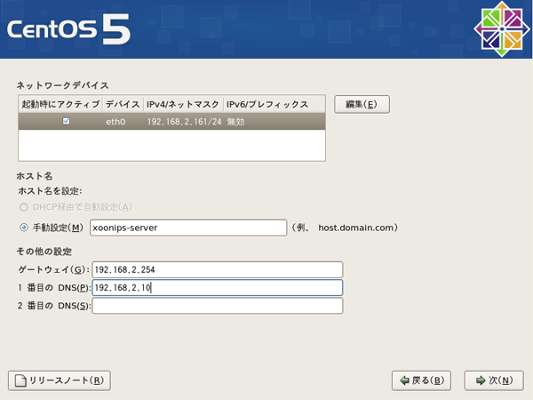
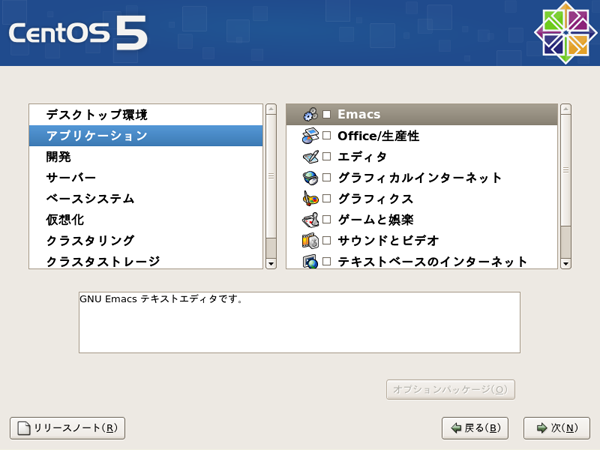
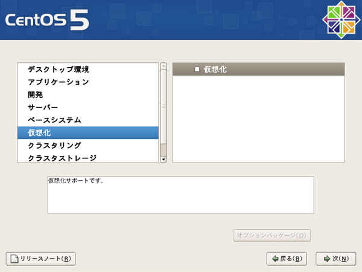
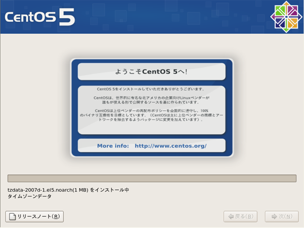

# 3.2. インストールの手順

 コンピュータにDVDを挿入しインストールを開始します。

 画面下にboot:と表示されたら、**Enter**キーを押して次に進みます。

## 3.2.1. **メディアテスト** 

 メディアのテストを行うか否かを選択します。

 ここではテストしないので**Tab**キーを押してSkipにカーソルを移動し、**Enter**キーを押して次に進みます。

## 3.2.2. **グラフィカルインストール** 

 X Window Systemが起動しこれ以降はキーボード、マウスを利用したグラフィカルな画面でインストールが可能です

 画面が表示されたら\[Next\]をクリックします。

## 3.2.3. **言語の選択** 

インストールに使用する言語を選択します。

日本語の場合はJapaneseを選択します。

 選択したら\[Next\]をクリックします。

## 3.2.4. **キーボードの設定** 

キーボードの種類を設定します。

コンピュータに接続しているキーボードの種類を選択します。

一般的な106日本語キーボード\(または109日本語キーボード\)の場合には日本語を選択します。

## 3.2.5. **ハードディスクの初期化** 

 ハードディスクを初期化するか否かの警告メッセージが表示されます。

 \[はい\]を選択してハードディスクを初期化します。

## 3.2.6. **パーティションの設定** 

Linuxをインストールするパーティションを選択します。

\[選択したドライブ上のすべてのパーティションを削除してデフォルトのレイアウトを作成します\]を選択します。

 \[次\]をクリックすると警告メッセージが表示されます

 \[はい\]をクリックしてパーティションを削除します。

## 3.2.7. **ネットワークの設定** 

 ネットワーク上にブロードバンドルータなどのDHCPサーバーがある場合にはそのまま\[次\]をクリックします。

コンピュータに固定IPアドレスを割り振りたい場合やネットワーク上にDHCPサーバが存在しない場合は\[編集\]ボタンをクリックします。

Enable IPv4 supportにチェックがあることを確認します。

Manual configrationにチェックを付けます。

IP AddressにサーバのIPアドレスを入力します。Prefix\(Netmask\)にはネットマスクを入力します。

Enable IPv6 supportのチェックを外します。

設定が出来たら\[OK\]をクリックします。

ネットワークデバイスの画面に戻ったらホスト名を決めて入力します。

ダイアログボックスの例にあるように\[ホスト名\].\[ドメイン名\]のように入力します。

例えば`hostname.domainname.org`のように入力します。

ゲートウェイの欄にゲートウェイのIPアドレスを入力します。

1番目のDNSの欄にDNSのIPアドレスを入力します。

設定が出来たら\[次\]をクリックします。

## 3.2.8. **タイムゾーンの設定** 

タイムゾーンを設定します。地図上の東京の位置をクリック或いは画面下の項目から直接アジア/東京を選択します。

\[システムクロックでUTCを使用\]はチェックを外します。

## 3.2.9. **rootパスワードの設定** 

rootパスワードの設定をします\(6文字以上\)

設定したパスワードは忘れないようにしてください。大文字小文字は区別されるので注意が必要です。

パスワードは確認の為2回入力します。

 パスワードを入力したら\[次\]をクリックします。

## 3.2.10. **インストールパッケージの選択** 

全てのチェックを外します。

画面下の\[今すぐカスタマイズする\]を選択して\[次\]をクリックします。

## 3.2.11. **インストールパッケージの選択２** 

 デスクトップ環境を選択して全てのチェックを外します。

 アプリケーションを選択して全てのチェックを外します。

 開発を選択して全てのチェックを外します。

 サーバーを選択して全てのチェックを外します。

 ベースシステムを選択して全てのチェックを外します。

 仮想化を選択して全てのチェックを外します。

 クラスタリングを選択して全てのチェックを外します。

 クラスタストレージを選択して全てのチェックを外します。

言語を選択して日本語のサポートにチェックを付けます。

それ以外のチェックは外します。

 \[次\]をクリックします。

## 3.2.12. **パッケージのインストール** 

 以下の画面で\[次\]をクリックするとインストールが開始されます。

 コンピュータの性能によって終了までの時間は異なります。

## 3.2.13. **インストールの完了** 

 以下の画面になったらDVDを取り出して\[再起動\]をクリックします。

