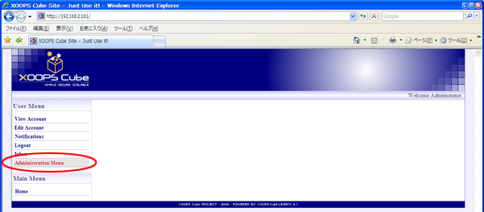
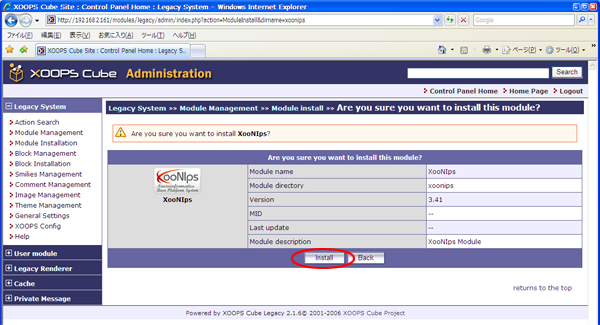

# 6.1. Set up for XooNIps

Access to [http://server](http://server) name/.

Enter the following information and click on the \[Login\] button.

| Username | Administrator's user name \(Example: Administrator\) |
| :--- | :--- |
| Password | Administrator's password |

Click on \[Administration Menu\].

Click on \[Module Installation\].

Click on the install icon at "Control".

Click on the "Install" button.

Click on \[Module Management\].

If the XooNIps is successfully installed, the screen shows as above.

