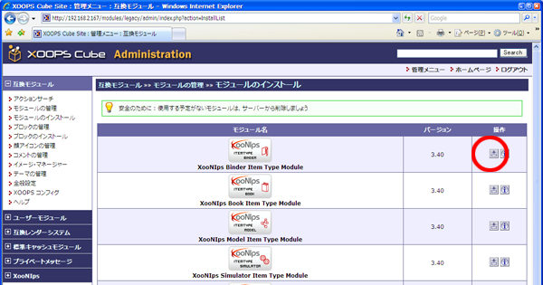

# 6.3. アイテムタイプモジュールのインストール

続いてアイテムタイプモジュールのインストールをします。

| アイテムタイプモジュールをmoduleディレクトリにコピー |
| :--- |
| `[root@xoonips-server ~]#` **cp -R xoonips-3.44/itemtypes/\* /var/www/html/modules/** |

## 6.3.1. **アイテムタイプモジュールのセットアップ** 

XooNIpsモジュールと同様の手順です。

セットアップするアイテムタイプモジュールの種類はWebサイトの計画と設計により変化します。

 \[モジュールのインストール\]をクリックします。

 XooNIpsのインストールと同様にインストールアイコンをクリックしてインストールします。

## 6.3.2. **XooNIpsインストール後の後始末** 

\*\*\*\*

| `[root@xoonips-server ~]#` **rm -f xoonips-3.44.tar.gz** | ← ダウンロードファイル削除 |
| :--- | :--- |
| `[root@xoonips-server ~]#` **rm -rf xoonips-3.44** | ← 展開ディレクトリ削除 |

