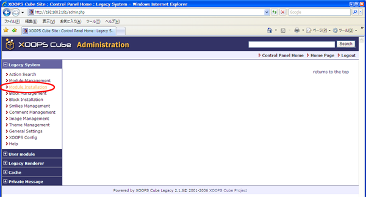

# 6.3. How to install item type modules:

Install item type modules.

| Copy the item type module to the module directory. |
| :--- |
| **\[root@xoonips-server ~\]\# cp -R xoonips-3.44/itemtypes/\* /var/www/html/modules/** |

## 6.3.1. Setup for item type modules 

The procedure is the same as XooNIps module.

The types of item type module vary with the structure of the website.

Click on \[Module Installation\]

Click on the install icon at "Control". \(same as XooNIps installation\)

## 6.3.2. Close the XooNIps installation 

| **\[root@xoonips-server ~\]\# rm -f xoonips-3.44.tar.gz** | ← Delete downloaded files. |
| :--- | :--- |
| **\[root@xoonips-server ~\]\# rm -rf xoonips-3.44** | ← Delete expanded directories. |

