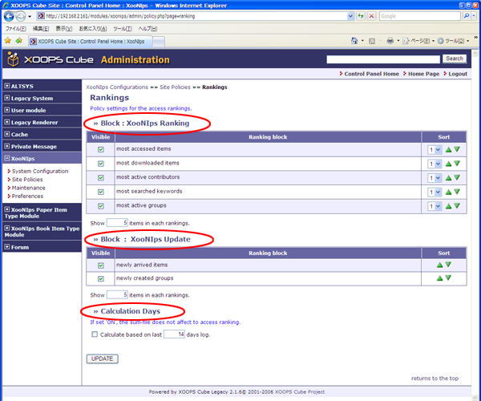

# 1.10. 'Rankings' \(XooNIps&gt;&gt;Site Policies&gt;&gt;Rankings\)

Policy settings for the access rankings.

* "Block: XooNIps Ranking"

  Check the checkbox of the items to be displayed.

  The display order can be changed by choosing either of the icons up or down at "Sort". The pulldown list can indicate the stages either up/downward by 1-4 levels.

  _If choose 2 and click on the upward triangle, the item will be shifted 2 levels upward._

  Define the range of ranking \(top 10, 20 or 30 ...\)

* "Block: XooNIps Update"

  Setup for newly arrived items setting:

  Define the range of ranking for newly arrived items.

* "Calculation Days"

  Duration for displaying the ranking.

  If the checkbox is checked, the sum-file does not affect to access ranking.

**Figure 4.15. "Rankings"**

