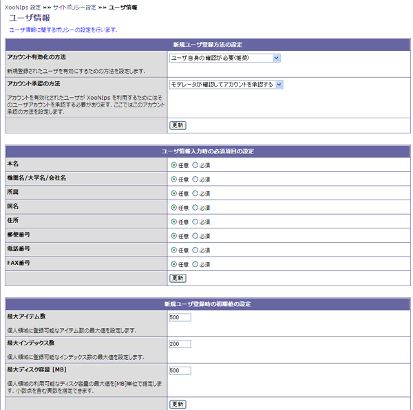

# 1.2. ユーザ情報

ユーザの承認方法やユーザ情報の設定を行います。

#### Tip

それぞれの項目について、更新ボタンを押して情報を反映させる必要があります。

* 新規ユーザ登録方法の設定

  XooNIpsはユーザー登録後、機能が使える登録ユーザーになるためにはモデレーターの承認が必要です。

  ユーザー登録した情報の有効化\(アクティベーション\)を行った後、更にXooNIpsを利用するためにはモデレーターの承認が必要です。

  * アカウント有効化の方法

    登録したユーザー情報を有効化する作業の手順を指定します。

    **Table 4.1. ユーザー有効化の手順の設定**

    | 項目 | 説明 |
    | :--- | :--- |
    | ユーザ自身の確認が必要（推奨） | ユーザー登録時のメールアドレスにユーザー情報の有効化を促すメールが送られます。ユーザーがメールに従い登録情報を有効化します。 |
    | 自動的にアカウントを有効にする | ユーザー情報は登録後自動的に有効になります。 |
    | 管理者が確認してアカウントを有効にする | XOOPSのadmisitratorがユーザー情報を有効化します。 |

  * アカウント承認の方法

    XooNIpsを利用出来るようにユーザーを承認する作業を行うか否かを指定します

    **Table 4.2. ユーザー承認を行うかの設定**

    | 項目 | 説明 |
    | :--- | :--- |
    | モデレータが確認してアカウントを承認する | XooNIpsのモデレーターがXooNIpsを利用出来るように承認をします。 |
    | 自動的にアカウントを承認する | XooNIpsへの承認作業は行われず、ユーザーは登録後直ぐにXooNIpsの利用が可能になります。 |

* ユーザ情報入力時の必須項目の設定

  ユーザー登録の際、入力項目を入力必須とするか未入力可とするかをそれぞれ指定します。

* 新規ユーザ登録時の初期値の設定

  登録ユーザーがPrivate領域に登録できるアイテムの上限とHDDの使用量の上限を指定します。

  **Table 4.3. ユーザーのHDD使用領域の設定**

  <table>
    <thead>
      <tr>
        <th style="text-align:left">&#x9805;&#x76EE;</th>
        <th style="text-align:left">&#x8AAC;&#x660E;</th>
      </tr>
    </thead>
    <tbody>
      <tr>
        <td style="text-align:left">&#x6700;&#x5927;&#x30A2;&#x30A4;&#x30C6;&#x30E0;&#x6570;</td>
        <td style="text-align:left">
          
Private(&#x500B;&#x4EBA;&#x9818;&#x57DF;)&#x306B;&#x767B;&#x9332;&#x51FA;&#x6765;&#x308B;&#x30A2;&#x30A4;&#x30C6;&#x30E0;&#x306E;&#x4E0A;&#x9650;&#x6570;&#x3092;&#x6307;&#x5B9A;&#x3057;&#x307E;&#x3059;&#x3002;

          
&#x30C7;&#x30D5;&#x30A9;&#x30EB;&#x30C8;&#x5024;&#x306F;&#xFF15;&#xFF10;&#xFF10;&#x3067;&#xFF15;&#xFF10;&#xFF10;&#x500B;&#x307E;&#x3067;&#x30A2;&#x30A4;&#x30C6;&#x30E0;&#x3092;&#x767B;&#x9332;&#x3067;&#x304D;&#x307E;&#x3059;&#x3002;

        </td>
      </tr>
      <tr>
        <td style="text-align:left">&#x6700;&#x5927;&#x30A4;&#x30F3;&#x30C7;&#x30C3;&#x30AF;&#x30B9;&#x6570;</td>
        <td
        style="text-align:left">
          
Private(&#x500B;&#x4EBA;&#x9818;&#x57DF;)&#x306B;&#x767B;&#x9332;&#x51FA;&#x6765;&#x308B;&#x30A4;&#x30F3;&#x30C7;&#x30C3;&#x30AF;&#x30B9;&#x306E;&#x6570;&#x3092;&#x6307;&#x5B9A;&#x3057;&#x307E;&#x3059;&#x3002;

          
&#x30C7;&#x30D5;&#x30A9;&#x30EB;&#x30C8;&#x5024;&#x306F;&#xFF12;&#xFF10;&#xFF10;&#x3067;&#xFF12;&#xFF10;&#xFF10;&#x500B;&#x307E;&#x3067;&#x30A4;&#x30F3;&#x30C7;&#x30C3;&#x30AF;&#x30B9;&#x3092;&#x767B;&#x9332;&#x51FA;&#x6765;&#x307E;&#x3059;&#x3002;

          </td>
      </tr>
      <tr>
        <td style="text-align:left">&#x6700;&#x5927;&#x30C7;&#x30A3;&#x30B9;&#x30AF;&#x5BB9;&#x91CF;</td>
        <td
        style="text-align:left">
          
Private(&#x500B;&#x4EBA;&#x9818;&#x57DF;)&#x3067;&#x4F7F;&#x7528;&#x3055;&#x308C;&#x308B;HDD&#x306E;&#x6700;&#x5927;&#x5BB9;&#x91CF;&#x3092;MB&#x5358;&#x4F4D;&#x3067;&#x6307;&#x5B9A;&#x3057;&#x307E;&#x3059;&#x3002;

          
&#x30C7;&#x30D5;&#x30A9;&#x30EB;&#x30C8;&#x5024;&#x306F;&#xFF15;&#xFF10;&#xFF10;MB&#x3067;&#x500B;&#x4EBA;&#x304C;&#x5229;&#x7528;&#x3067;&#x304D;&#x308B;&#x30C7;&#x30A3;&#x30B9;&#x30AF;&#x4F7F;&#x7528;&#x91CF;&#x306F;&#xFF15;&#xFF10;&#xFF10;MB&#x306B;&#x306A;&#x308A;&#x307E;&#x3059;&#x3002;

          </td>
      </tr>
    </tbody>
  </table>

 **Figure 4.2. ユーザー設定**

