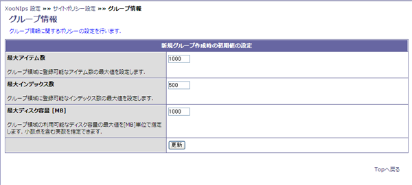

# 1.3. グループ情報

Policy settings for the group information \(Define the maximum number of items to be registered in a group area and the limit of HDD area to be used by the group\).

**Table 4.4. "Initial properties of newly created groups"**

| Category | Description |
| :--- | :--- |
| Maximum number of items | Set the maximum number of items to be registered in a group area. |
| Maximum number of indexes | Set the maximum number of indexes to be registered in a group area. |
| Maximum Storage size | Set the maximum storage size in a group area. |

**Figure 4.3. "Group Information"**

