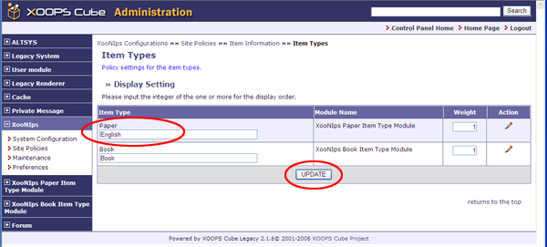
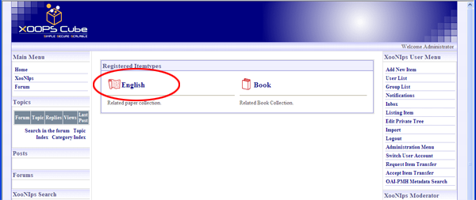

# 1.5. 'Item Types' \(XooNIps&gt;Site Policies&gt;Item Information&gt;Item Types\)

How to change the title and order of item types shown on the homepage:

Ex. Change a title Paper to English.

**Figure 4.5. "Dispaly Setting"**

Change Paper to English on the "Display Setting" \(XooNIps&gt;&gt;Site Policies&gt;&gt;Item Information&gt;&gt;Item Types\).

**Figure 4.6. Display Setting 2**

A title displayed on the homepage will be changed from Paper to English.

**Figure 4.7. Display Setting - 3**

