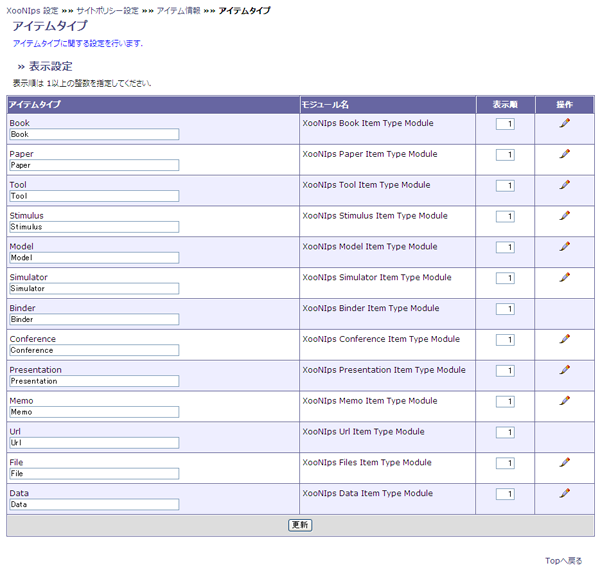

# 1.5. アイテムタイプ

ホームページ上でアイテムタイプの表示名と表示順を変更できます。

PaperをEnglishに変更する場合

**Figure 4.5.**  **表示名の変更**

サイトポリシー設定画面でPeperをEnglishに変更します。

画面下の「更新」ボタンを押します。

**Figure 4.6.**  **表示名の変更2**

 ホームページ上での表示がPaperからEnglishに変更されます。

**Figure 4.7.**  **表示名の変更3**

