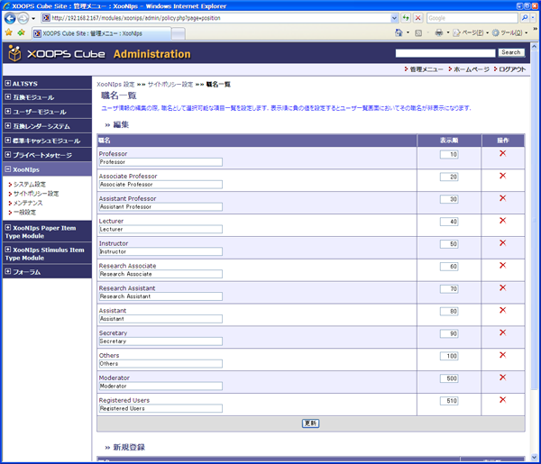

# 1.9. 職名一覧

表示順と新規追加などの設定です

ユーザー情報の職名として選択可能な項目を設定します。

* 編集

  職名の変更と表示順の設定はテキストボックスに入力して更新ボタンを押して情報を更新します。

  表示順の数値順にユーザ一覧で表示されます。

  操作の項目のアイコンをクリックするとその項目は削除されます。

  ※デフォルトの職名は削除出来ません。

* 新規登録

  新たに職名を追加することが出来ます。

**Figure 4.14.**  **職名一覧設定**

