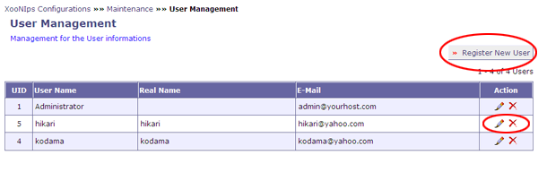

# 2.2. 'User Management' \(XooNIps&gt;&gt;Maintenance&gt;&gt;User Management\)

How to manage user information \(editing/deleting user information, registering new users, etc.\).

**Figure 4.17. "User Management"**

Click on a pen-icon to edit user information.

Click on a X-icon to delete user information.

## 2.2.1. "Register New user" \(click on \[Register New User\], upper right of the "User Management" screen\). 

Edit the new user's information. The required fields are indicated by "\*". Fill out the fields and click on \[UPDATE\] below.

Use this screen for changing passwords.

The required fields vary with the setups made on \(XooNIps - Site Policies -\) User Information.

* Username

  Enter a handle \(online name\) of the user to be displayed on XooNIps

* Real Name

  Enter the user's real name

* Email

  Enter email address. Check the checkbox if allow other users to view the email address.

* Website

  Enter the URL to be published.

* User's Groups

  Choose a XOOPS group which the user belongs to.

  **Table 4.8. "User's Groups"**

  | Pulldown menu | Description |
  | :--- | :--- |
  | Webmasters | Make the user belong to the webmasters group as XOOPS indicates. |
  | Registered User | Make the user belong to the registered users group as XOOPS indicates. |
  | Moderator | Make the user belong to the moderator group of XooNIps. |

* Position

  Choose the user's position from the pulldown list.

* Division

  Enter the division the user belongs to.

* Company Name

  Enter the company/university/institution name the user belongs to.

* Phone Number

  Enter the telephone number if wish to publish it.

* FAX Number

  Enter the fax number if wish to publish it.

* Address

  Enter the address if wish to publish it.

* Country

  Enter the country where the user live.

* Zipcode

  Enter the ZIP code, if wish to publish it.

* Time zone

  Choose a time zone according to the user's country.

* Interests

  Enter the user's interests, if wish to publish it.

* Free Description

  Describe anything you want.

* Signature

  Enter the user's signature. Check/uncheck the checkbox "Always attach my signature".

* Password

  Register a password.

* Verify Password

  Enter the password again to confirm it.

* New Item Mail Notification \[per day\]

  Set the frequency of email notification by the day.:" \(Listed later in this section\).

  This is applicable only if it's been set as "Email \(Pulldown menu\)" at "Notification Method:" \(Listed later in this section\).

* Maximum Private Items

  Enter the maximum number of items to be registered in a private area.

  Default value: 500

* Maximum Private Indexes

  Enter the maximum number of indexes for a private area.

  Default value: 200

* Maximum Disk Space for Private Items \[MB\]

  Enter the maximum disk capacity for a private area by the MB.

  Default value: 500

* Comment Display Mode

  Choose a comment display mode from the pulldown menu.

  This is for XOOPS standard comment function. Note that this is not for adding comments to the items on XooNIps3.4.

  **Table 4.9. Comment Display Mode**

  | Comment Display Mode \(Pulldown\) | Description |
  | :--- | :--- |
  | Nested | Comments will be nest-displayed. |
  | Flat | Comments will be flat-displayed. |
  | Threaded | Comments will be sorted by groups according to the title. |

* Comments Sort Order

  Choose either of "Oldest First" or "Newest First" from the pulldown menu.

  **Table 4.10. Comments Sort Order**

  | Pulldown menu | Description |
  | :--- | :--- |
  | Oldest First | Comments will be sorted out from the oldest to the newest. |
  | Newest First | Comments will be sorted out from the newest to the oldest. |

* Rank

  Setup for ranking

  Leave it as it is.

* Notification Method: When you monitor e.g. a forum, how would you like to receive notifications of updates?

  Define a manner of receiving notification messages of updated events.

  **Table 4.11. Notification Method**

  | Pulldown menu | Comment |
  | :--- | :--- |
  | Temporarily Disable | Temporarily stop receiving the messages. |
  | Private Message | via PM function of XOOPS. |
  | Email \(use address in my profile\) | via the registered email address. |

* Default Notification Mode

  Define the timing for being notified.

  **Table 4.12. Default Notification**

  | Pulldown menu | Comment |
  | :--- | :--- |
  | Notify me of all selected updates | To be notified every time events are updated. |
  | Notice me only once | To be notified only once |
  | Notify me once then disable until I log in again. | Once it notifies, it won't notify until it is logged in again. |

* Receive occasional email notices from administrators and moderators?

  Choose "Yes", if wish to receive email messages about news update on XooNIps.

**Figure 4.18. "Register New User"**

The entered information can be viewed at the "User Information" \(on a XooNIps website, User Menu &gt;&gt; User List\).

