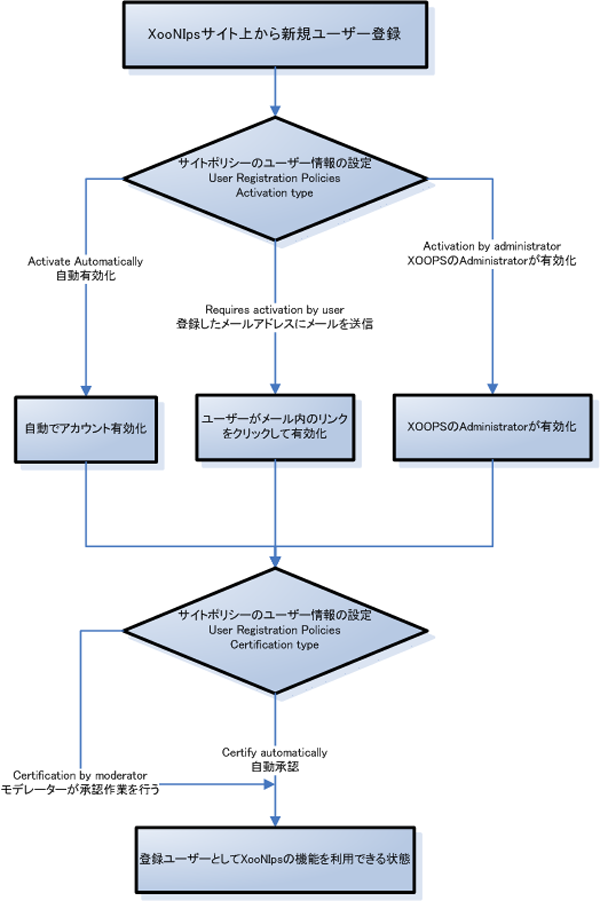
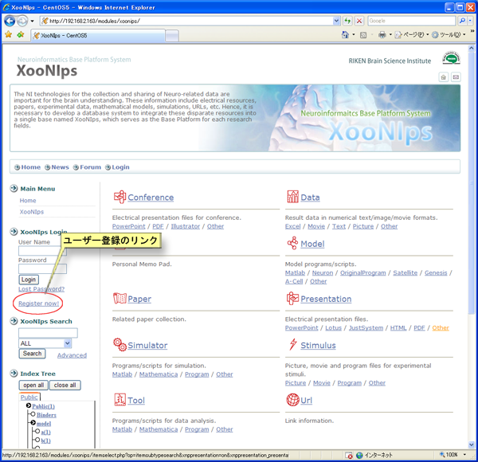
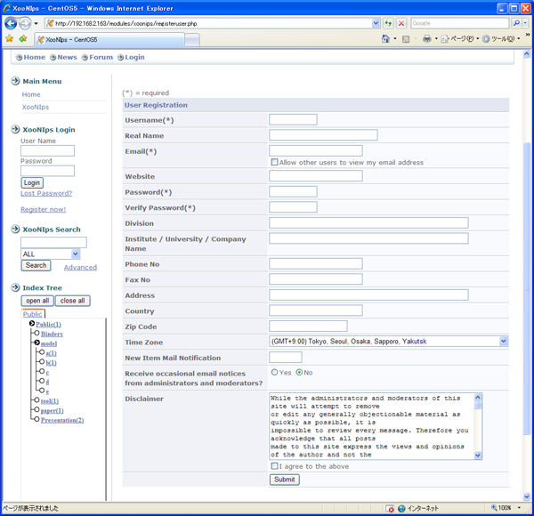

# 1.4. サイト入会・登録

 新規ユーザー登録の概要を説明します。

## 1.4.1. **サイト登録の流れ** 

XooNIpsの機能を利用出来るようになるにはユーザー登録の他にモデレーターによる承認が必要です。

#### Tip

サイトポリシーの設定により自動で承認される場合もあります。

**Figure 5.8. 登録の流れ**  

## **1.4.2. 登録の手順**

新規登録のリンクをクリックします。

#### Tip

サイトのデザインによってこの位置にあるとは限りません。

**Figure 5.9. 新規入会**  

必要事項に情報を入力して登録を行ってください。

サイトポリシーで必須入力とされている項目には＊が付いています。

サイトポリシーの設定によっては登録作業後にモデレーターの承認が必要となります。

 **Figure 5.10. 新規登録**

