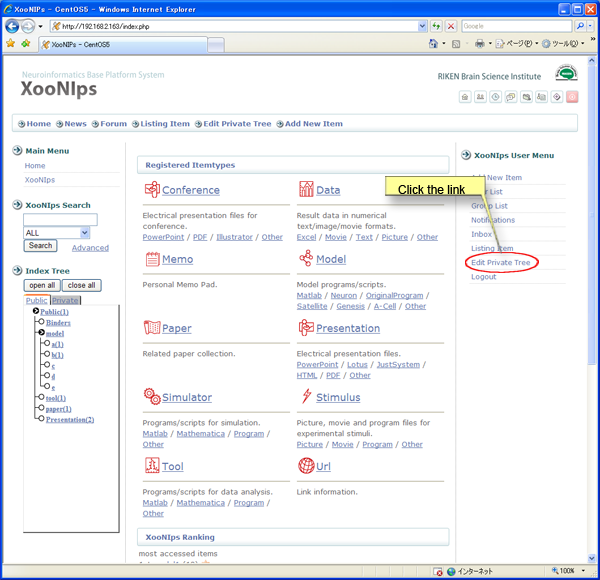
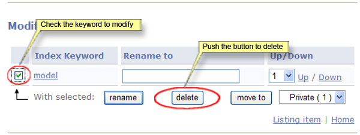
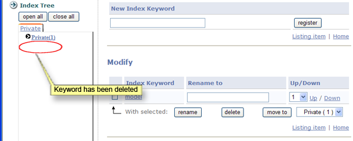
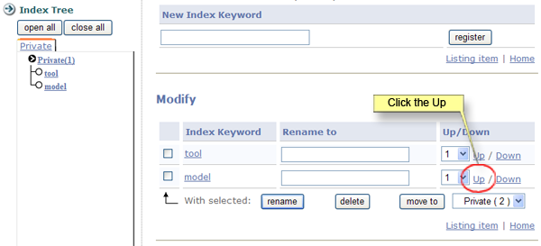
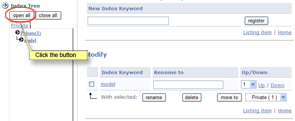
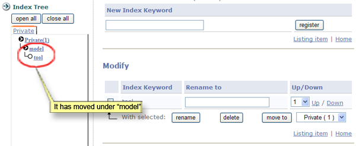

# 2.3. Edit private \(index\) trees

How to organize and manage the items in a private area:

Click on the link \[Edit Private Tree\] at "XooNIps User Menu".

**Figure 5.13. Edit private trees.**

1. How to register a new keyword:

   Enter a new keyword in the field "New Index Keyword", and click on the \[register\] button.

   

   **Figure 5.14. Edit private trees**

   A new index keyword will be registered underneath the private tree

   

   **Figure 5.15. Register a new keyword to the private index.**

2. How to change keywords:

   Registered keywords can be modified.

   Check the keyword to be modified and enter a new keyword in the field "Rename to", then click on the \[rename\] button.

   

   **Figure 5.16. Change keywords**

   The keyword "tool" has been changed to "model".

   

   **Figure 5.17. Index Tree with a changed keyword.**

3. How to delete a keyword:

   Check the checkbox of the keyword to be deleted and click on the \[delete\] button.

   

   **Figure 5.18. Delete a keyword**

   

   **Figure 5.19. Index \(the keyword has been deleted\)**

4. Change the order of keywords:

   How to change the order of Keywords:

   Indicate a number from 1 to 10 from the dropdown list at "up/down".

   

   **Figure 5.20. Change the order of keywords**

   

   **Figure 5.21. Index \(the order of keywords has been changed\)**

5. Shift keywords

   How to shift keywords:

   Choose one from the dropdown list next to the \[move to\] button and click on it.

   

   **Figure 5.22. Shift keywords**

   To show the result, click on the \[open all\] button at the "Index Tree".

   

   **Figure 5.23. Show the shifted keyword**

   The keyword \[tool\] has been shifted underneath \[model\].

   

   **Figure 5.24. Index \(the keyword has been shifted\)**

