# 2.4. Item management

## 2.4.1. Item management 

How to register new items:

Click on the link \[Add New Item\] at "XooNIps User Menu".

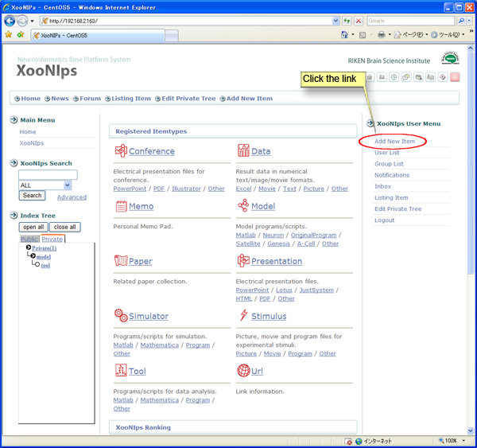

**Figure 5.25. New item registration**

Choose an item type from the dropdown list.

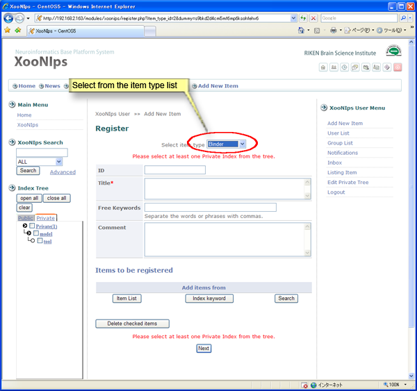

**Figure 5.26. Choose a new register item type.**

After choosing an item type, a "Register" screen appears.

Check at least one checkbox of a keyword at "Private" index to which the item belongs.

The items with "\*" are required.

For the "ID" field, always enter the same value. If the ID is duplicated, it will be regarded as an error.

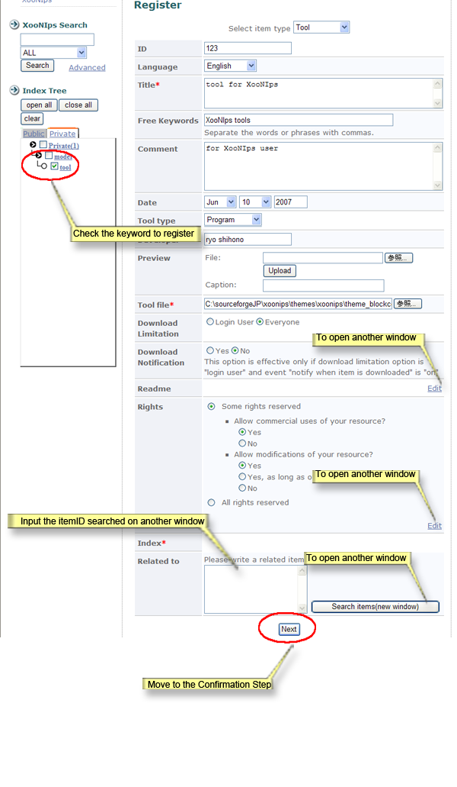

**Figure 5.27. Register items \(TOOL\)**

* "Download Limitation":

  Decide whom to be permitted to download the items \(ex. login users only or all the users including guests\).

* "Download Notification":

  An option available only if login users are set to be permitted to download the items.

  It depends on the system configuration of the site.

* "Readme":

  Click on the link \[Edit\], and a window will open. Indicate a file and click on the \[upload\] button; or, directly edit in the textbox and click on the \[OK\] button.

  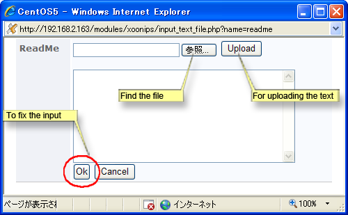

  **Figure 5.28. Edit Readme**

* "Rights":

  To set the Creative Commons license. Or, edit an original license, click on the link \[edit\] to open an edit window.

  Rights edit window:

  Click on the link \[Edit\] to open an edit window. Indicate a file and click on the \[upload\] button. Or edit an original text in the textbox and click on the \[upload\] button.

  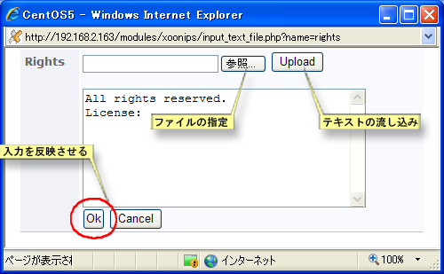

  **Figure 5.29. Edit Rights**

* "Related to":

  To indicate other related items.

  To identify the items to be registered in a related item, use either of the following 3 commands on the "Register" screen.

  * \[Item list\]

    Choose items from the item list.

  * \[Index keyword\]

    Choose the item to be registered in a related item by using Index Tree.

  * \[Search\]

    Choose the item to be registered in a related item by using detail search.

  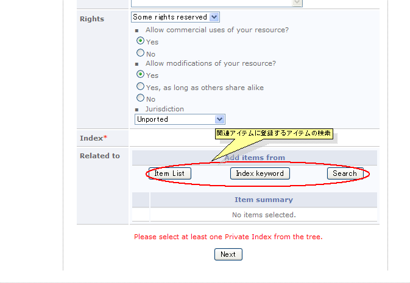

  **Figure 5.30. Detail of an item**

  1. How to choose by \[Item list\]

     Click on \[Item list\]. Choose items from the list showing the applicable items \(registered in the Public Index and the user's private index.\)

     Check the checkbox of the item to be registered and click on the \[Select\] button to confirm.

     ![Item registration by \[Item list\]](../../.gitbook/assets/xoonips-operate31.png)

     **Figure 5.31. Item registration by \[Item list\]**

  2. How to choose by an index keyword:

     Click on an intended keyword at "Private" index.

     Check the checkbox of the item to be registered in a related item and click on the \[Select\] button to confirm the registration.

     ![Item registration by \[Index Keyword\]](../../.gitbook/assets/xoonips-operate132.png)

     **Figure 5.32. Item registration by \[Index Keyword\]**

  3. How to choose by \[Search\]

     Click on \[Search\], and a "Detail" search screen will appear. Search the item to be registered in a related item in the same manner as normal search.

     Check the checkbox of the intended item and click on the \[Select\] button.

  Click on the \[Next\] button to confirm the registration.

  

  **Figure 5.33. Item registration confirmation screen**

## 2.4.2. Edit items 

Go to the "Detail" screen of the intended item. Use "Index Tree" or "XooNIps Search" to search for it.

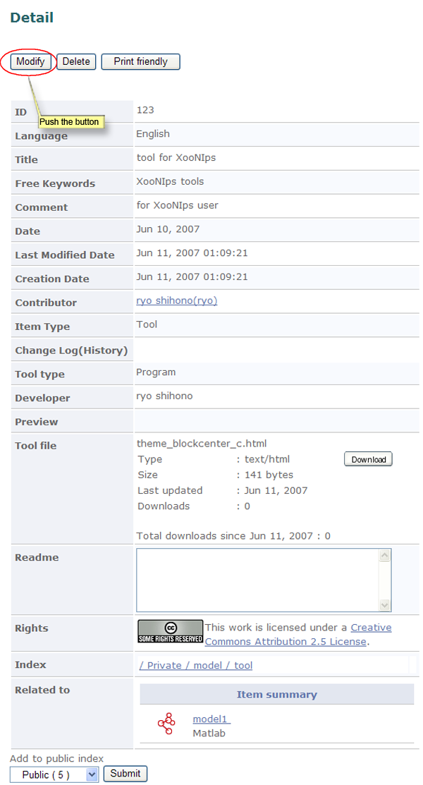

**Figure 5.34. Detail of an item**

Click on \[Modify\] button, and a "Modify" screen will appear. Make modifications as necessary and click on \[Next\] button.

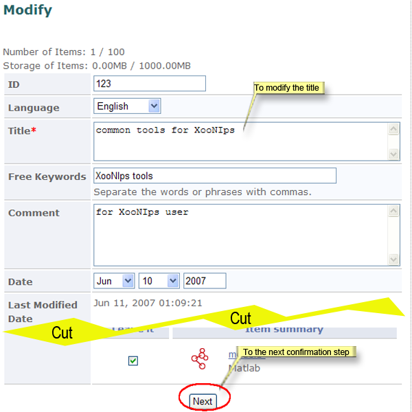

**Figure 5.35. Modify details of an item**

On the "Detail" screen, modification history will be shown.

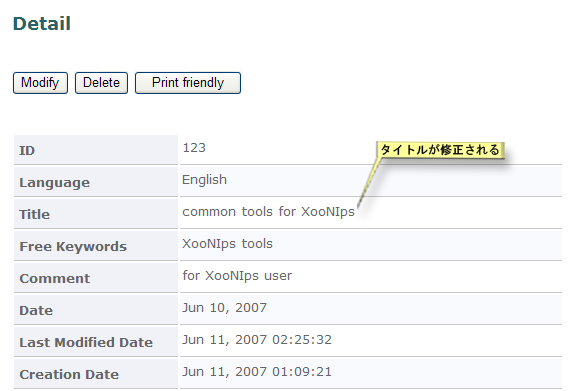

**Figure 5.36. Item modification history**

## 2.4.3. How to delete items: 

Delete items

Go to the "Detail" screen of the item to be deleted. Use "Index Tree" or "XooNIps Search" for search the intended item.

Click on the \[Delete\] button to open a dialog box and choose \[OK\].

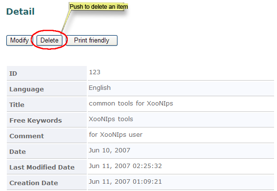

**Figure 5.37. Delete items**

## 2.4.4. Binder item type 

"Binder" is an item type, by which items can be collectively managed.

To identify the items to be registered in a Binder, use either of the following 3 commands on the "Register" screen.

* \[Item list\]

  Choose items from the item list.

* \[Index keyword\]

  Choose the item to be registered in a Binder by using Index Tree.

* \[Search\]

  Choose the item to be registered in a Binder by using detail search.

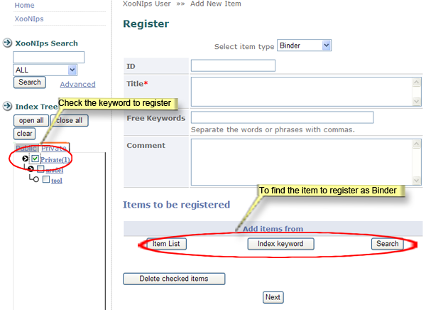

**Figure 5.38. Binder registration screen**

1. How to choose by \[Item list\]

   Click on \[Item list\]. Choose items from the list showing the applicable items \(registered in the Public Index and the user's private index.\)

   Check the checkbox of the item to be registered and click on the \[Select\] button to confirm.

   ![Binder registration by \[Item list\]](../../.gitbook/assets/xoonips-operate37.png)

   **Figure 5.39. Binder registration by \[Item list\]**

2. How to choose by an index keyword:

   Click on an intended keyword at "Private" index.

   Check the checkbox of the item to be registered in a Binder and click on the \[Select\] button to confirm the registration.

   ![Binder registration by \[Index Keyword\]](../../.gitbook/assets/xoonips-operate38.png)

   **Figure 5.40. Binder registration by \[Index Keyword\]**

3. How to choose by \[Search\]

   Click on \[Search\], and a "Detail" search screen will appear. Search the item to be registered in a Binder in the same manner as normal search.

   Check the checkbox of the intended item and click on the \[Select\] button.

Click on the \[Next\] button to confirm the registration.

**Figure 5.41. Binder registration confirmation screen**

## 2.4.5. Register items \(paper type\) 

On the "Register" screen for Paper items \(XooNIps User Menu&gt;&gt;Add New Item; pulldown menu "Paper" at "Select item type"\), there is "PubMedID" field. If a PubMedID is given, enter the ID and click on the \[Complete\] button, then the other following related information will be automatically filled out.

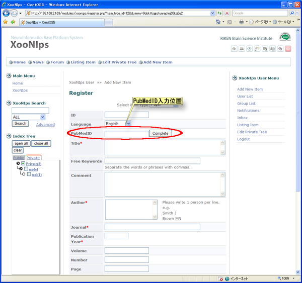

**Figure 5.42. "Register" screen for Paper items**

## 2.4.6. Register items \(Book type\) 

On the "Register" screen for Book item, there is ISBN code field. If the code is identified, enter it \(10 or 13 digits\) and click on the "Complete" button, then the other related information will be automatically filled out. In this case, the URL field will be filled with the detailed information provided by Amazon.

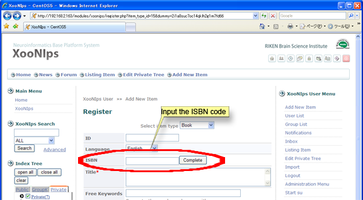

**Figure 5.43. Registration screen for Book items**

