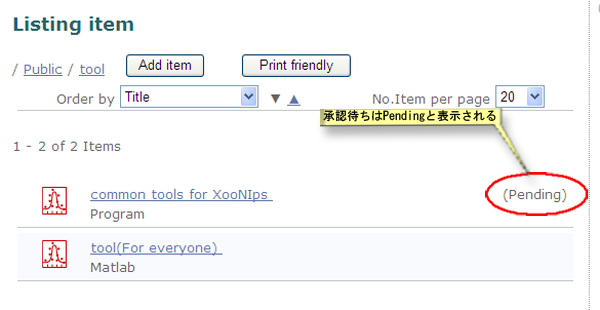

# 2.5. アイテムの公開

 アイテムをPublic領域に登録するためにはサイトポリシーの設定によってモデレーターの審査・承認が必要な場合があります。

**Figure 5.44.**  **アイテム公開フロー**

## 2.5.1. **アイテムの公開** 

Public領域に登録して公開したいアイテムをIndex TreeやXooNIps検索で検索して、詳細画面を表示します。

公開領域に追加の欄あるドロップダウンリストから登録したいPublic領域のIndex keywordを選択して、「追加」ボタンを押します。

**Figure 5.45.**  **公開アイテム登録画面**

 サイトポリシーの設定によってはモデレーターの審査・承認が必要ですので、Public領域に直ぐに登録されるとは限りません。

**Figure 5.46.**  **公開アイテム確認画面**

