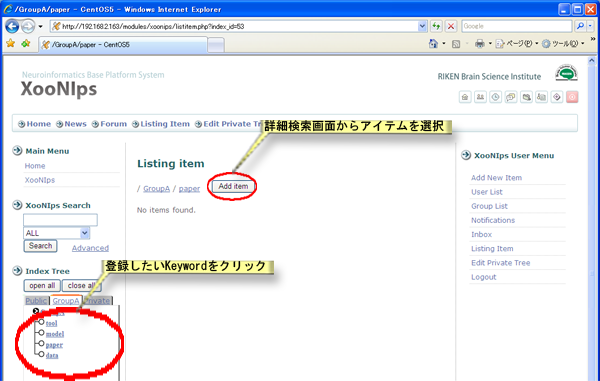

# 2.6. グループ

XooNIpsでは登録ユーザーでグループを作ることが出来ます。

グループにはグループ内で情報を共有できる領域が与えられます。

## 2.6.1. **グループに参加** 

XooNIpsに登録されているグループを検索します。

グループ管理者となっているユーザーにグループに追加してもらうよう、メールやPM\(Private Message\)で連絡を取ります。

グループへのユーザー追加登録作業は、グループ管理者またはモデレーターが行います。

**Figure 5.47.**  **登録グループの確認**

**Figure 5.48.**  **登録グループの確認2**

 グループに参加すると、所属グループのタブがIndex Treeに表示されます。

**Figure 5.49.**  **所属グループのタブ**

## 2.6.2. **グループIndexへのアイテム登録** 

ユーザーがPrivate領域に登録しているアイテムをグループIndexに登録することが出来ます。

登録したいグループのタブでIndex Keywordをクリックします。

アイテム検索画面が表示されますので、登録するアイテムを検索してください。

**Figure 5.50.**  **グループIndexへの登録.**

 グループIndexへ登録するアイテムにチェックを付けます。

**Figure 5.51.**  **グループIndexへの登録2**

 グループ管理者、またはモデレーターの審査・承認が完了するまで他のユーザーからはアイテムは見ることが出来ません。

**Figure 5.52.**  **グループIndexへの登録3**

## 2.6.3. **グループからの退会** 

グループから退会する場合は参加の場合と同様に、グループ管理者かモデレーターに連絡を取ってください。

ユーザーのグループからの退会処理はグループ管理者、またはモデレーターが行います。

