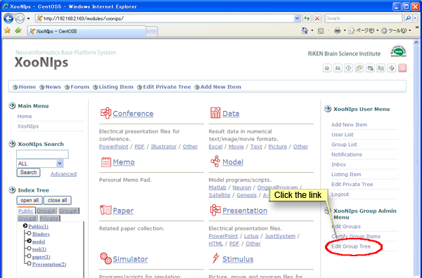
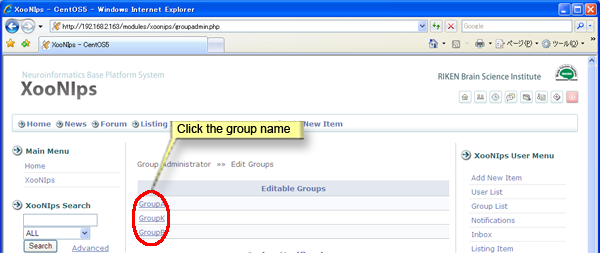
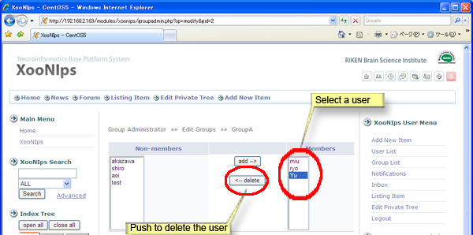
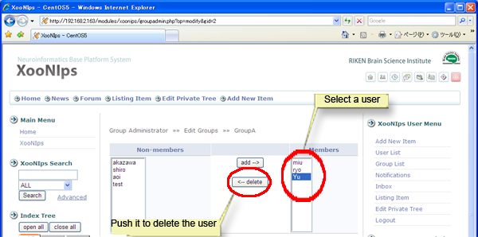

# 3.1. Manage group members:

Click on the link \[Edit Group Tree\] on the XooNIps Group Admin menu.

The link is not always located as shown due to the variety of site designs.

**Figure 5.58. Add/delete group a member.**

How to add/delete a group member: click on the group name. If you are an administrator managing more than one group, choose the intended group name and click on it.

**Figure 5.59. Add/delete group members 2**

## 3.1.1. Add a member 

How to add a member: choose a user listed at "Non-members" and click on the \[Add\] button.

**Figure 5.60. Add a group member**

## 3.1.2. Delete a member 

How to delete a member: choose a user listed at "Members" and click on \[delete\] button.

**Figure 5.61. Delete a group member**

