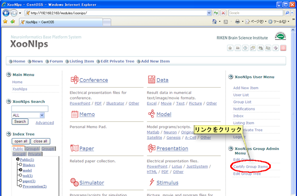
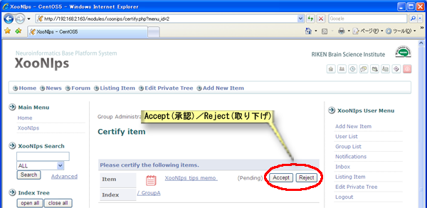

# 3.2. 共有アイテムの審査・承認

グループで共有するアイテムの審査・承認をします。

XooNIps グループメニューのグループ共有アイテム承認をクリックします。

#### Tip

グループIndex Treeや検索を使ってアイテムの詳細画面から審査・承認をすることも出来ます。

**Figure 5.62. グループ共有アイテムの審査・承認**  

インデックスの欄にチェックを付けて「Accept\(承認\)」または「Reject\(取り下げ\)」のボタンを押して、アイテムの公開を承認・却下といった、審査が出来ます。

 **Figure 5.63. グループ共有アイテムの審査・承認2**

