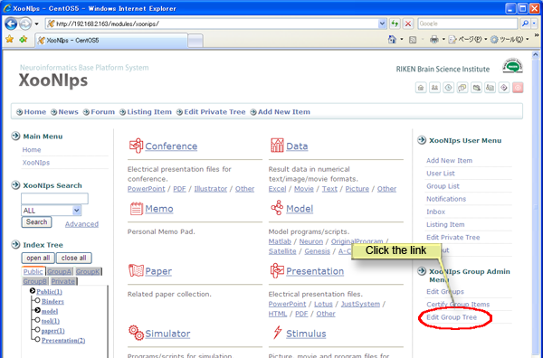
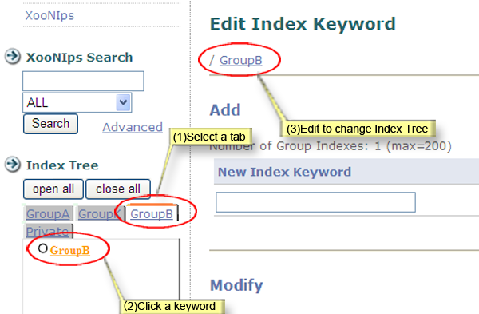

# 3.4. Edit group indexes

Keywords at a group index can be added, deleted and edited in the same manner as Private.

Click on the \[Edit Group Tree\] on the "XooNIps Group Admin Menu".

**Figure 5.65. Edit a group index.**

How to edit group indexes: \(If you are an administrator managing more than one group, choose an intended group index tab.\)

1. Click on the group index tab.
2. Click on a keyword to be edited.
3. Continue to edit the group index.

**Figure 5.66. Edit a group index 2**

