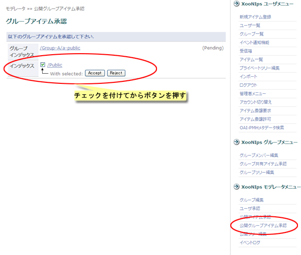

# 3.5. Publish a group index

The items registered in a group index can be collectively transferred to the public index by each keyword:

* Group administrator

  Click on the \[Edit Group Tree\] at "XooNIps Group Admin menu".

  

  **Figure 5.67. Block publishing of group indexes**

  At the "Publication group item" check the checkboxes of the keywords to be published.

  By the dropdown list, choose a public index keyword to which the checked index keywords are to be added. Click on the \[Submit\] button.

  

  **Figure 5.68. Block publishing of group indexes 2**

* Moderator

  Click on the link \[Certify Public Group Items\] at the "XooNIps Moderator menu".

  

  **Figure 5.69. Block publishing of group indexes 3**

  Check the checkbox either of \[Approve\] or \[Reject\].

  Decide whether or not to publish the item by clicking on \[Accept\] or \[Reject\].

