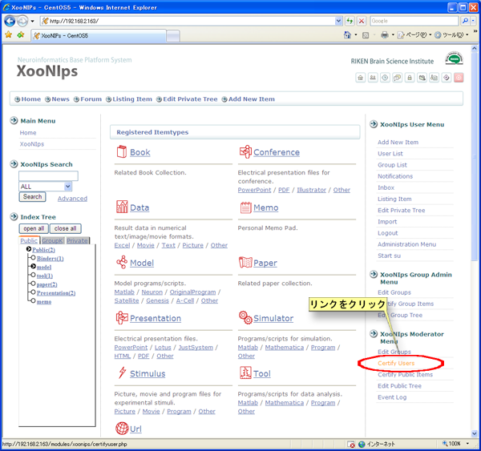

# 4.2. ユーザーの承認

サイトポリシーの新規ユーザ登録方法の設定でアカウント承認の方法の項目がモデレータが確認してアカウントを承認するの場合には登録ユーザーがXooNIpsの機能を利用できるようにするためにアカウントの承認をする必要があります。

XooNIps モデレータメニューのユーザ承認のリンクをクリックします。

**Figure 5.71.**  **ユーザーの承認**

リンクをクリックすることで以下の機能が実行されます。

* メールアドレス

  メーラーが起動してそのメールアドレスにメールを送ることが出来ます。

* 詳細

  ユーザーが登録した情報の詳細画面を表示します。

* 承認

  ユーザーの承認又は拒否が出来ます。承認をしないとユーザーはXooNIpsの機能を利用できません。

**Figure 5.72.**  **ユーザーの承認2**

