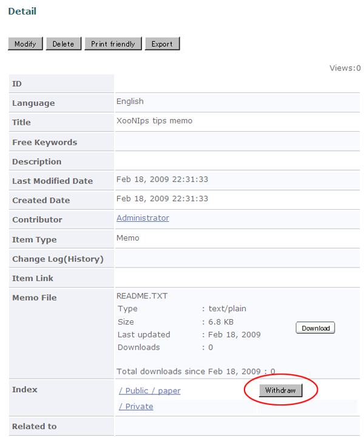

# 4.4. 公開アイテムの取り下げ

公開済みアイテムの公開取り下げをすることが出来ます。

Index Treeや検索を利用して公開を取り下げたいアイテムの詳細画面を表示させます。

Indexの項目の「Withdraw」ボタンを押すと確認のダイアログが表示されますので「OK」を選択してアイテムの公開を取り下げます。

**Figure 5.75.**  **公開アイテムの取り下げ**

