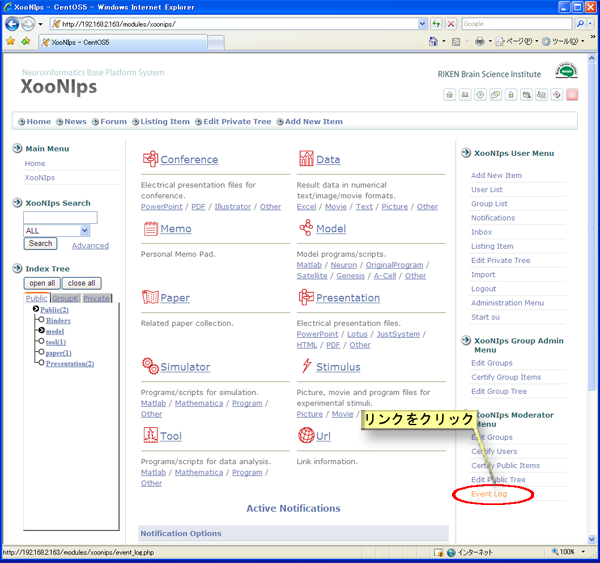

# 4.6. アクセスログ解析

XooNIpsが取得しているイベントログをCSV形式ファイルでダウンロードしたり、グラフ化することが出来ます。

XooNIps モデレータメニューのイベントログのリンクをクリックします。

**Figure 5.78.**  **イベントログ解析**

* イベントログダウンロード

  イベントログのダウンロード

  期間を指定してXooNIpsのイベントログをCSV形式ファイルでダウンロード出来ます。

**Figure 5.79.**  **イベントログの期間指定ダウンロード**

* イベント別

  トップページのアクセス、アイテムへのアクセス、アイテムのダウンロード、新規ユーザーの登録とアイテム登録について期間を指定してCSV形式ファイルでダウンロードするかグラフ化して表示することが出来ます。

**Figure 5.80.** **イベントログ及びユーザ・アイテム一覧の個別ダウンロードとグラフ表示**

**Figure 5.81.**  **イベントログのグラフ表示**

* 登録状況確認

  ユーザー及びアイテム一覧を見ることが出来ます。

