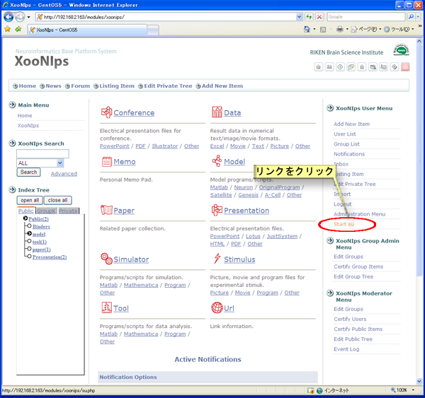
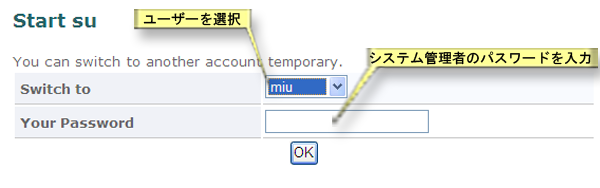

# 5.2. ユーザー切り替え機能

XooNIpsでは登録したアイテムは登録したユーザーのみがアイテムの変更・修正が可能です。

システム管理者は他ユーザー権限での実行が出来ますので、他ユーザーの登録したアイテムであっても変更・修正が可能となります。

XooNIps ユーザメニューのアカウント切り替えのリンクをクリックします。

**Figure 5.82.**  **ユーザ切り替え機能**

 ドロップダウンリストからユーザーを選択してシステム管理者のパスワードを入力します。

**Figure 5.83.**  **ユーザ切り替え機能2**

 ユーザーとしての作業を終了したら、XooNIps ユーザメニューのアカウント切り替え\(ユーザー名\)の終了のリンクをクリックします。

**Figure 5.84.**  **ユーザ切り替え機能3**

