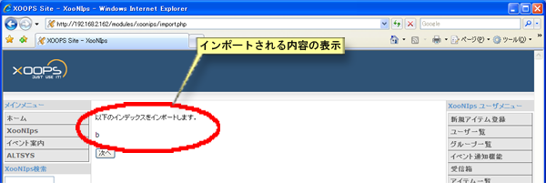

# 5.4. インポート

他のXooNIpsサイトでエクスポートしたアイテムや、Index Keywordのファイルを読み込んで利用することが出来ます。

XooNIps ユーザメニューのインポートをクリックします。

**Table 5.1. インポート機能**

| 項目名 | 機能 |
| :--- | :--- |
| Importするファイル | インポートするファイルを選択します。 |
| 公開インデックスに登録するアイテムを自動承認する | アイテムのインポート先がPublic領域だった場合にアイテムの公開承認を自動的に行います。 |
| エラーチェックだけを行う | エラーチェックのみで実際のインポート処理は行いません。 |
| ログを出力する | インポート処理のログを表示します。\(デフォルトでチェックが入っています。） |

インポート先のIndex Keywordにチェックを入れて、インポートファイルを選択したら「次へ」ボタンを押します。

**Figure 5.91.**  **インポート**

 ログを出力するにチェックをした場合、インポートエラーがあった場合には内容が表示されるので「戻る」ボタンを押して前の画面に戻り修正します。

**Figure 5.92.**  **インポートエラーログ**

エラーが無い場合は確認画面が表示されますので、「インポート」ボタンを押してインポートを実行します。

衝突の解決

インポートファイルに重複するKeywordやアイテムがある場合に上書きするかどうかの確認画面が表示されます。

**Figure 5.93.**  **衝突の解決**

