# 5.1. Set up for XOOPS

Access to [http://server](http://server) name/

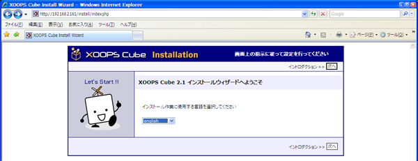

Choose a preferred language and click on \[Next\].

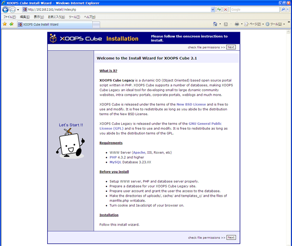

Click on \[Next\].

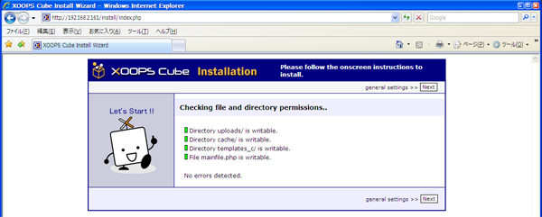

Click on \[Next\].

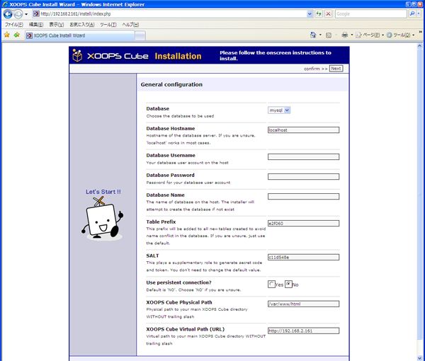

Enter the database user name, database password and database name which decided on MySQL setup.

Fill in the blanks with the following information and click on \[Next\].

| Database Username | xoonipsuser |
| :--- | :--- |
| Database Password | xoonips@pass |
| Database Name | xoonipsdb |

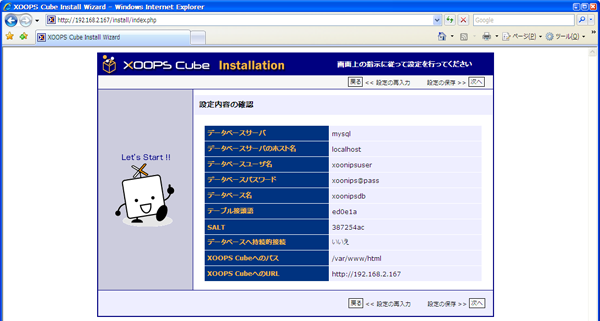

Click on \[Next\].

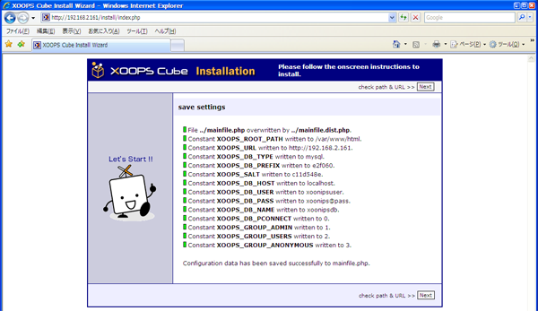

Click on \[Next\].

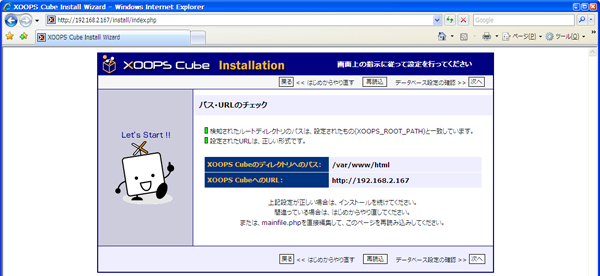

Click on \[Next\].

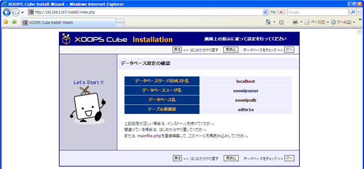

Click on \[Next\].

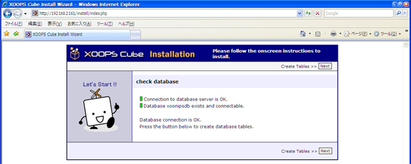

Click on \[Next\].

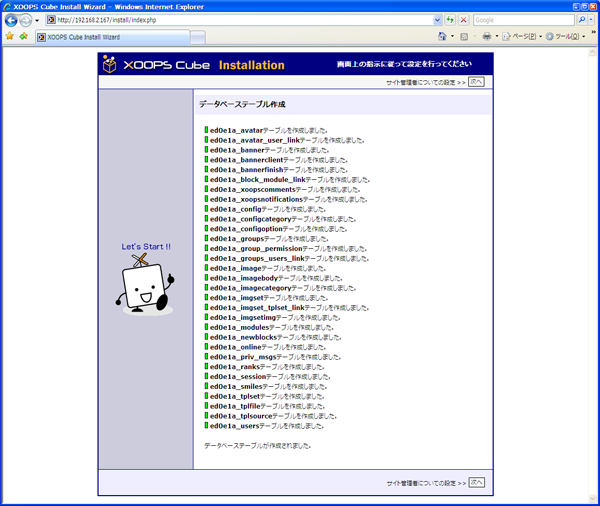

Click on \[Next\].

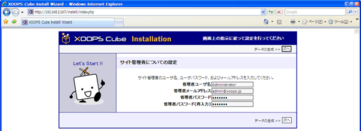

Enter the following information and click on \[Next\].

Note that this is for the administrator of XOOPS.

It is different from the users of CentOS and MySQL.

| Admin Name | XOOPS site administrator's user name \(Example: Administrator\) |
| :--- | :--- |
| Admin Email | XOOPS site administrator's mail address \(Example: admin@xoonips.jp\) |
| Admin Password | Password |
| Confirm Password | Password |

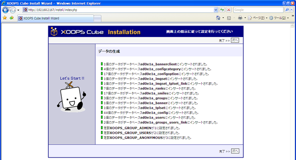

Click on \[Next\]

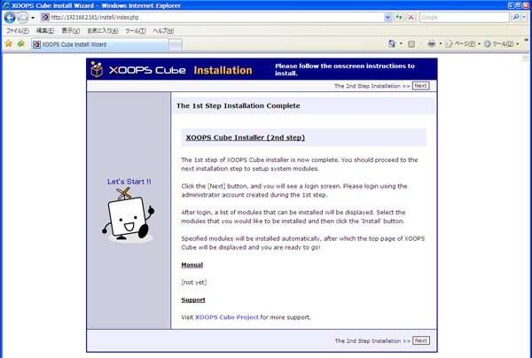

Click on \[Next\].

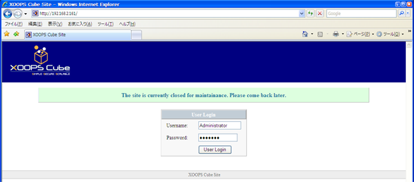

Enter the XOOPS admin name and click on \[User Login\].

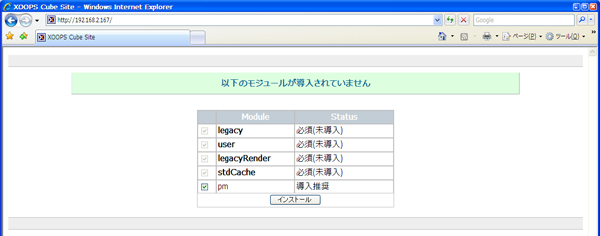

Click on the "Install" button.

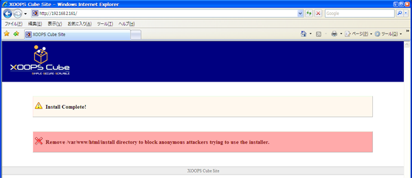

The installation has completed.

Close the web browser now.

