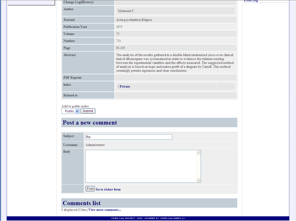

# 1.7. 'Item Comment' \(XooNIps&gt;&gt;Site Policies&gt;&gt;Item Information&gt;&gt;Item Comment\)

Comment settings for the item. This function depends on d3forum module.

It has to be installed d3forum module and create forum before setting these options.

* "Directory setting"

  Set the directory name of d3forum used by comment function.

* "Forum ID setting"

  Set the forum ID made with d3forum.

**Figure 4.9. "Item Comment"**

Other settings:

Modify the last line of "xoonips\_detail.html" by using the template editing function of altsys module.

Delete &lt;_{3 letters and the last 3 letters}_&gt; at the beginning.

**Figure 4.10. Item Comment \(Setting 2\)**

**Figure 4.11. Item Comment \(Setting - 3\)**

Enter the line below at the "Format for comment-integration" field \(Item comment&gt;&gt;Forum Manager\).

**{XOOPS\_URL}/modules/xoonips/detail.php?item\_id=%s**

**Figure 4.12. Item Comment \(Setting - 4\)**

Now, comments can be added to an item on its "Detail" screen.

