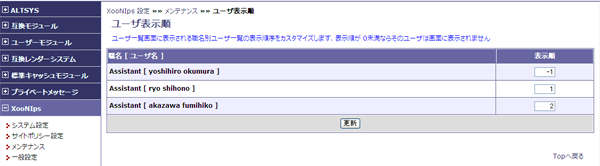
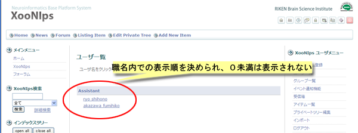

# 2.4. 'User List' \(XooNIps&gt;&gt;Maintenance&gt;&gt;User List\)

Order each of the user by entering numbers at the "Weight" field and click on the \[UPDATE\] button.

If the user is set as 0 or less, it will not be displayed.

"Position" is the only to be applied for reorganizing the User List.

**Figure 4.25. "User List"**

The result can be found at the "User List" of the intended XooNIps website.

**Figure 4.26. User List - 2**

