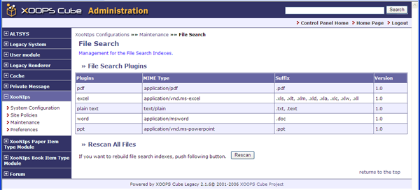

# 2.6. 'File Search' \(XooNIps&gt;&gt;Maintenance&gt;&gt;File Search\)

Management for the file search indexes:

* "File Search Plugins"

  Display the list of available file search plugins.

* "Rescan All Files"

  Click on \[Rescan\] when the version of a plugin is updated and it is necessary to rebuild the file search indexes.

**Figure 4.28. "File Search"**

