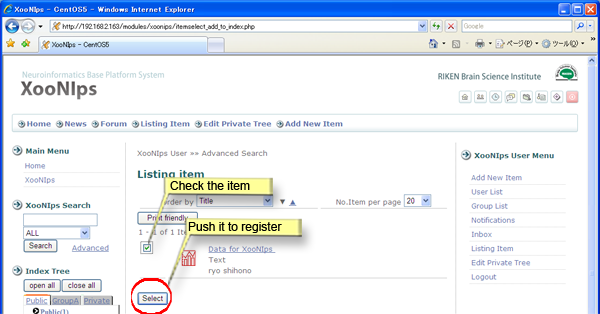

# 2.6. Group

XooNIps allows to make a group among the registered users.

The group will be given a specific area where information can be shared with the members.

## 2.6.1. Join a group 

Search a group registered on XooNIps.

Contact the group administrator via email or private message to ask for group admission.

The group administrator or moderator will perform the operations for adding members to the group.

**Figure 5.47. Inquire registered groups**

**Figure 5.48. Inquire registered groups 2**

When a user joins a group, a group tab will be added in the Index Tree.

**Figure 5.49. Group tab**

## 2.6.2. Item registration to a group index 

How to register items in a user's private area to a group area:

Click on the index keyword to be registered at the intended group tab.

A "Listing Item" screen will appear. Search the intended item.

**Figure 5.50. Register to a group index.**

Check the checkbox of the item to be registered to the group index.

**Figure 5.51. Registration to a group index 2**

The other group members can not view the registered item until the group administrator or moderator completes the review and approval.

**Figure 5.52. Registration to a group index - 3**

## 2.6.3. Resign from a group 

Contact the group administrator or moderator in the same manner as the group admission.

The group administrator or moderator perform the procedure for membership cancellation.

