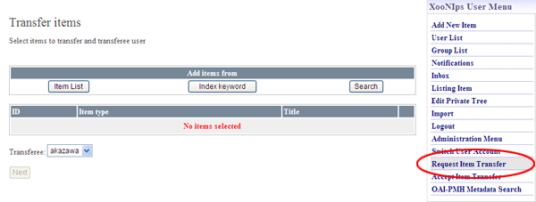
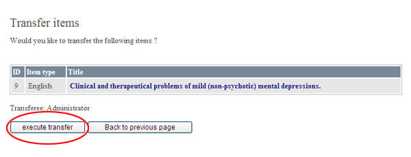

# 2.7. Item transfer

Basically, an item's edit authority is given only to the user who originally registered/requested to register the item.

When the user resigns from the membership, he/she can transfer their items to another user.

* How to transfer an item:

  Click on the link \[Request Item Transfer\] on XooNIps user menu.

  

  **Figure 5.53. "Request Item Transfer"**

  Identify the item to be transferred. Use either of \[Item List\], \[Index keyword\], \[Search\] at "Add items from" for searching it.

  

  **Figure 5.54. Request Item Transfer 2**

  Choose the user who transfers his/her authority \(transferee\) by the dropdown list and click on the \[Next\] button.

  

  **Figure 5.55. Request Item Transfer 3**

  A confirmation screen will appear. Click on the \[execute transfer\] button.

  

  **Figure 5.56. Request Item transfer 4**

* How to transfer a user's editing authority to another user:

  Click on the link of "Accept Item Transfer".

  Choose an index tree keyword to register the transferred item and click on the \[Accept\] button.

  

  **Figure 5.57. Accept Item Transfer**

