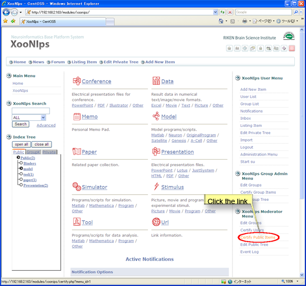
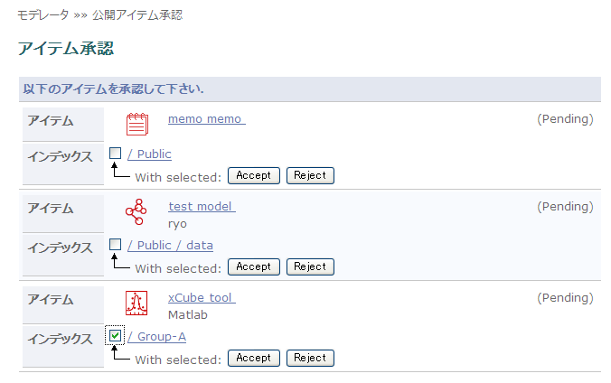

# 4.3. Review and certify items

How to review and decide whether or not to certify the item as a publishing item for the public area:

Click on the link \[Certify Public Items\] at the "XooNIps Moderator menu".

**Figure 5.73. Review and certify items**

Click on either of \[Accept\] or \[Reject\] button.

**Figure 5.74. Review and certify items 2**

