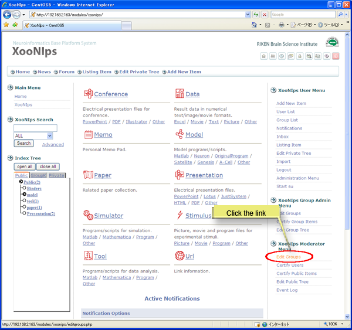
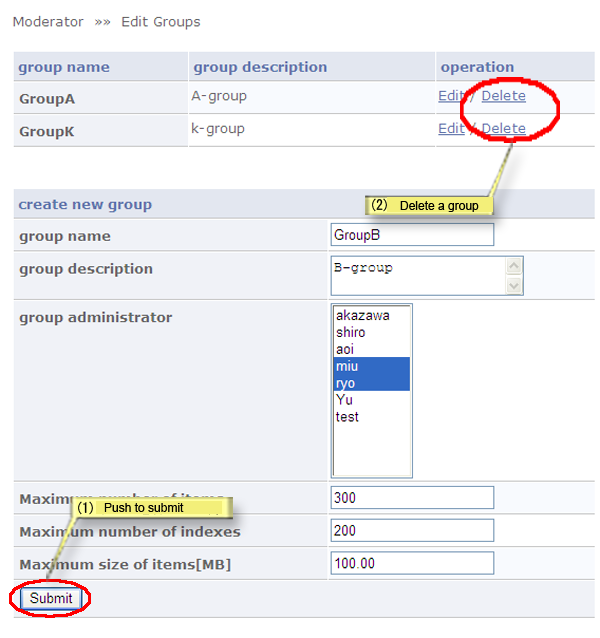

# 4.5. Create/delete a group

How to create/delete a group:

Click on the link \[Edit Groups\] at the "XooNIps Moderator menu".

**Figure 5.76. Create/delete a group**

## 4.5.1. Create/delete a new group 

1. Create a new group: enter the required information in each field and click on \[Submit\] button.
2. Delete a group: click on the link \[Delete\], and a dialog box will appear. Click on \[OK\].
3. "Group Name"

   Enter the group's name.

4. "Group Description"

   Edit the group's description.

5. "Group Administrators"

   Choose a user as a group administrator \(Multiple choice is acceptable\).

6. "Maximum number of items"

   Enter the maximum number of the item to be registered in the group area.

7. "Maximum number of indexes"

   Enter the maximum number of the keywords for the group index.

8. "Maximum size of items \[MB\]"

   Enter the maximum value of data for the group area.

**Figure 5.77. Create/delete a group**

## 4.5.2. Edit group information 

Click on the pen-icon \(or \[edit\] link\) on the right side of the intended group.

Click on the \[Submit\] button to update the information.

