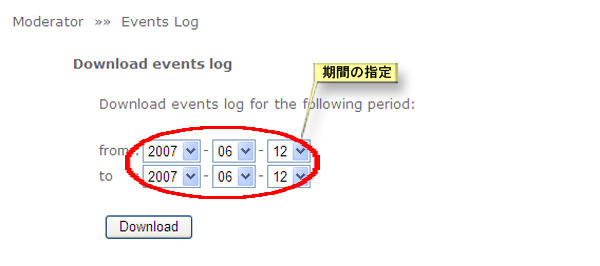
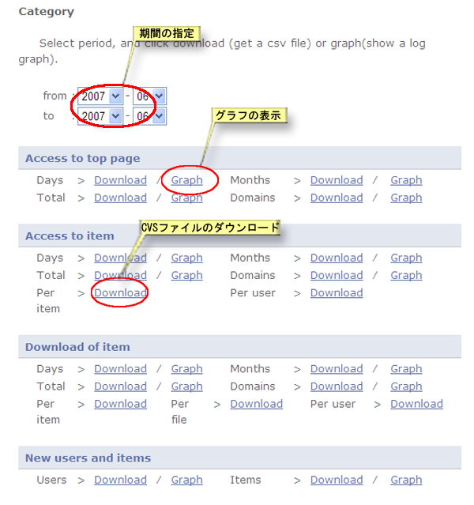

# 4.6. Access log analysis

How to download event logs on XooNIps in a CSV formatted file or transform the data into a graphic chart:

Click on the link \[Event Log\] at the "XooNIps Moderator's menu".

**Figure 5.78. Even log analysis**

* Download event logs

  How to download event logs:

  Indicate a period for the intended event logs. The data will be downloaded in CSV formatted file.

  

  **Figure 5.79. Download event logs by indicating a period**

* By the event

  Indicate a specific period. Choose "Download" or "Graph" for each category: "Access to top page", "Access to item", "Download of item" and "New users and items".

  

  **Figure 5.80. Download and graphic chart**

  

  **Figure 5.81. Event log graphic chart**

* "Registered Information"

  List the status of registered users and items.

