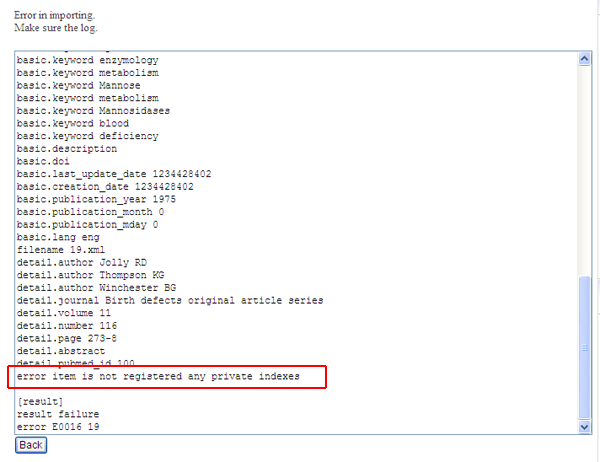

# 5.4. Import

How to load the items and index keywords imported from other XooNIps sites:

Click on the \[Import\] button at the XooNIps User menu.

**Table 5.1. Import functions**

|  | Description |
| :--- | :--- |
| "File to import" | Select the file to be imported. |
| "To certify items automatically" | If the item is to be imported to the public area, it will be automatically certified publishing. |
| "Don't import \(Error check only\)" | Perform error check but do not import. |
| "Logging" | Show the importing logs. \(default\) |

Check the checkbox of the index keyword to which an intended file will be imported. Choose the file to be imported and click on the \[Next\] button.

**Figure 5.91. Import**

If "logging" is checked and any errors occur, error descriptions will be displayed. Return to the previous screen and modify them.

**Figure 5.92. Import error log**

If there is no error, click on the import button.

Refrain from unwanted overwriting:

It is subject to confirm whether or not to overwrite the file if it is found to include duplicated keywords or items.

**Figure 5.93. Refrain from unwanted overwriting**

