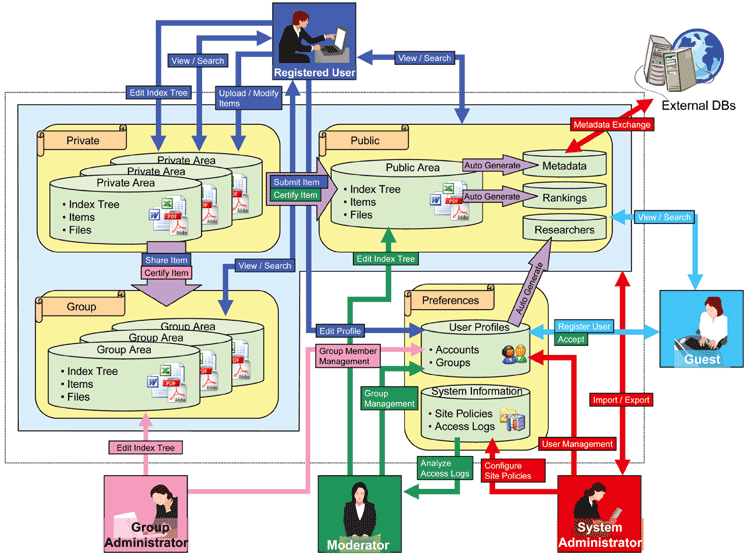

### _XOOPS Documentation Series_

# Module XooNIps: Neuroinformatics Base Platform System
#### for XOOPS 2.5.8

Module Version 3.49

Tutorial Version 3.45    
      

            
## View it on:  

© 2016 XOOPS Project ([www.xoops.org](http://xoops.org)), [XooNIps](http://xoonips.osdn.jp/), [Riken](http://www.riken.jp/)

## Module Purpose 

XooNIps is an easy-to-use software that can facilitates to build a database website for organizing enormous volume of information in various types of electronic formats, such as research papers, experrimental data, mathematical models, and programs along with the metadata, and to share them with users worldwide on the internet.

*Figure 1: Main view of the XooNIps Module (Admin side)*

## Download/Fork the Module  

**You can fork the module --> [here](https://github.com/XoopsModules25x/xcl-module-xoonips))** 

## How to Contribute

[You can contribute on GitHub](https://github.com/XoopsDocs/XXX-tutorial). Changes will be [pushed to Gitbook.io automatically](https://www.gitbook.com/book/xoops/xoonips-tutorial/activity) when the [main repository](https://github.com/XoopsDocs/xoonips-tutorial) changes.

Editing the book can be done either by updating the markdown files with a text editor, or opening the repository in [the Gitbook desktop app](https://github.com/GitbookIO/editor/blob/master/README.md). The desktop app will give you a live preview option.

# Table of Content

* [Introduction](book/0introduction.md)
* [Overview](book/1overview.md)
* [Start guide](book/2startguide.md)
* [Installation](book/3installation.md)
* [Administration](book/4admin.md)
* [Operations](book/5operations.md)
* [Copyright notice](book/6copyright.md)
* [Module Credits](book/9credits.md)
* [About XOOPS CMS](book/10aboutxoops.md)
* [Module Credits](book/9credits.md)
* [About XOOPS CMS](book/10aboutxoops.md)
* [Appendix A](book/appendix.md)

##License:

 Unless specified, this content is licensed under a <a rel="license" href="http://creativecommons.org/licenses/by-nc-sa/4.0/">Creative Commons Attribution-NonCommercial-ShareAlike 4.0 International License</a>.

All derivative works are to be attributed to XOOPS Project ([www.xoops.org](http://xoops.org))
