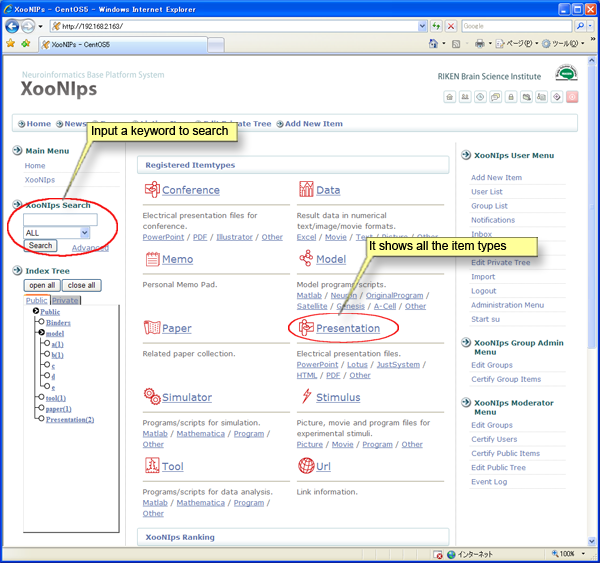
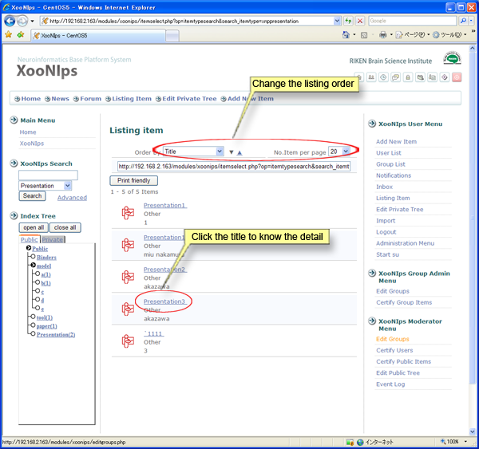
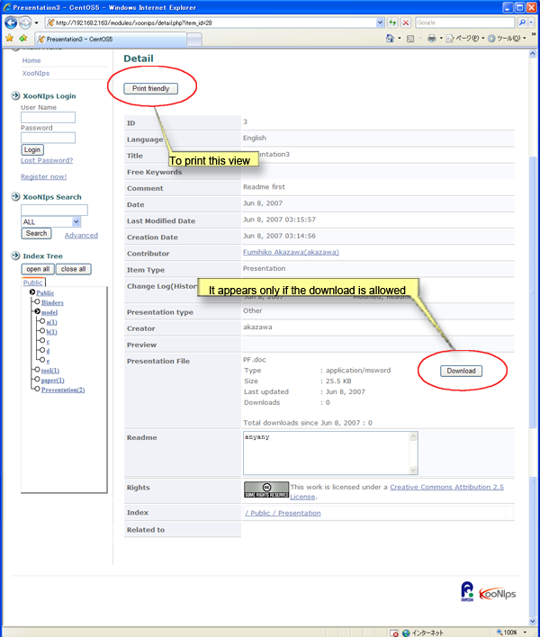
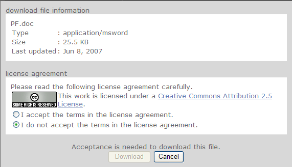

### 1.1. How to search and browse the published items (information): {#1-1-how-to-search-and-browse-the-published-items-information}

The guest users are permitted to search and browse the registered items in the public area.

A list will be displayed by clicking on an item type (ex. &quot;Binders&quot;, &quot;model&quot; as described) at the &quot;Index Tree&quot;.

&quot;XooNIps Search&quot; is for searching items by item type or metadata.

**Figure 5.1. Home page**

On a &quot;Listing item&quot; screen, the order of the listed items can be changed by the pulldown menu at &quot;Order by&quot;. The conditions vary with the item types.

**Figure 5.2. &quot;Listing item&quot; (search result)**

On a &quot;Detail&quot; screen, [Download] button will appear only if the item is permitted to be downloaded by guest users.

**Figure�5.3.�&quot;Detail&quot;**

Downloading will be permitted only if the user agrees with the license condition.

**Figure�5.4.�&quot;License agreement&quot;**