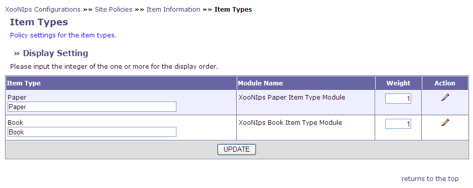
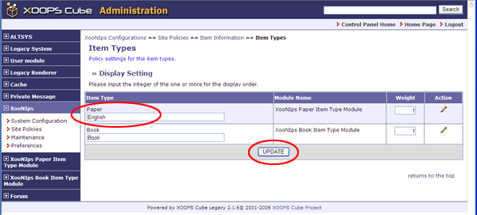
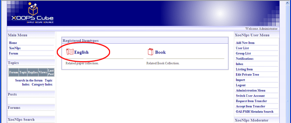

### 1.5.�&quot;Item Types&quot; (XooNIps&gt;Site Policies&gt;Item Information&gt;Item Types) {#1-5-item-types-xoonips-site-policies-item-information-item-types}

How to change the title and order of item types shown on the homepage:

Ex. Change a title Paper to English.

**Figure�4.5.�&quot;Dispaly Setting&quot;**

Change Paper to English on the &quot;Display Setting&quot; (XooNIps&gt;&gt;Site Policies&gt;&gt;Item Information&gt;&gt;Item Types).

**Figure�4.6.�Display Setting 2**

A title displayed on the homepage will be changed from Paper to English.

**Figure�4.7.�Display Setting - 3**