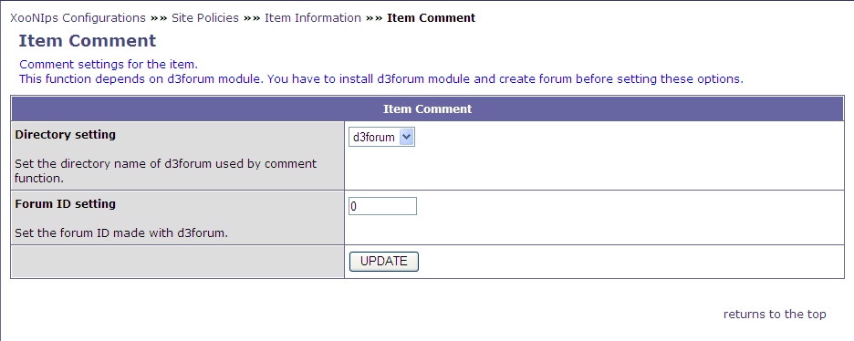
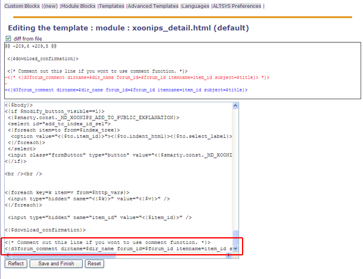
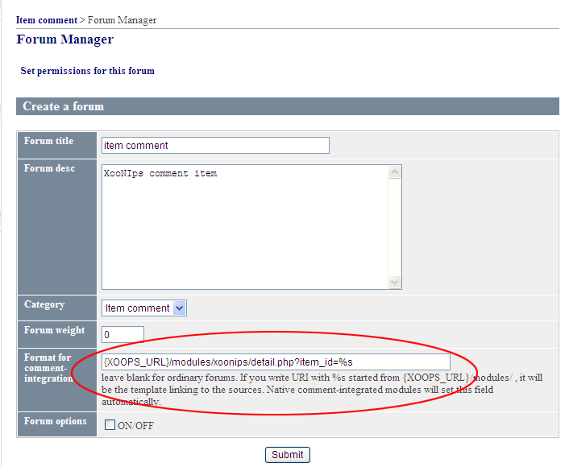
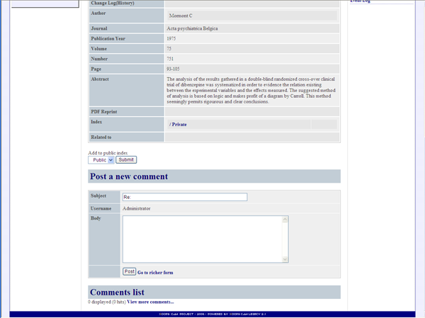

### 1.7.�&quot;Item Comment&quot; (XooNIps&gt;&gt;Site Policies&gt;&gt;Item Information&gt;&gt;Item Comment) {#1-7-item-comment-xoonips-site-policies-item-information-item-comment}

Comment settings for the item. This function depends on d3forum module.

It has to be installed d3forum module and create forum before setting these options.

*   &quot;Directory setting&quot;

    Set the directory name of d3forum used by comment function.

*   &quot;Forum ID setting&quot;

    Set the forum ID made with d3forum.

**Figure�4.9.�&quot;Item Comment&quot;**

Other settings:

Modify the last line of &quot;xoonips_detail.html&quot; by using the template editing function of altsys module.

Delete &lt;*{3 letters and the last 3 letters}*&gt; at the beginning.

**Figure�4.10.�Item Comment (Setting 2)**

**Figure�4.11.�Item Comment (Setting - 3)**

Enter the line below at the &quot;Format for comment-integration&quot; field (Item comment&gt;&gt;Forum Manager).

**{XOOPS_URL}/modules/xoonips/detail.php?item_id=%s**

**Figure�4.12.�Item Comment (Setting - 4)**

Now, comments can be added to an item on its &quot;Detail&quot; screen.