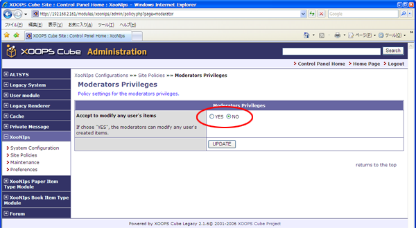

### 1.8.�&quot;Moderators Privileges&quot; (XooNIps&gt;&gt;Site Policies&gt;&gt;Moderators Privileges) {#1-8-moderators-privileges-xoonips-site-policies-moderators-privileges}

Policy settings for the moderators privileges.

If choose yes, the moderators can modify any user&#039;s items.

**Figure�4.13.�&quot;Moderators Privileges&quot;**