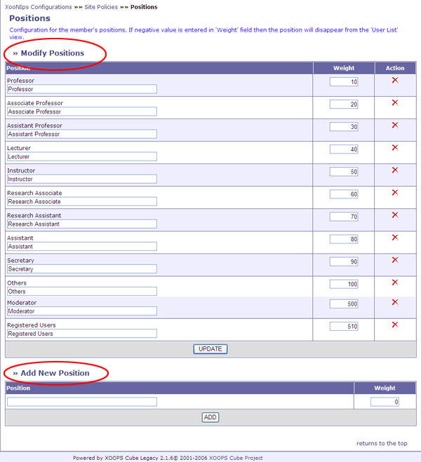

### 1.9.�&quot;Positions&quot; (XooNIps&gt;&gt;Site Policies&gt;&gt;Positions) {#1-9-positions-xoonips-site-policies-positions}

Configuration for the member&#039;s positions (display order and new entries, etc).

List possible job titles as user information.

*   &quot;Modify Positions&quot;

    For changing job titles and their orders, enter the information in the textbox and click on the [UPDATE] button.

    The result will be displayed on a user list by the indicated order.

    By clicking on the icon at &quot;Action&quot;, the indicated field will be deleted.

*   &quot;Add New Position&quot;

    Add a new job title. Enter a new job title in the field and click on [Add].

**Figure�4.14.�&quot;Positions&quot;**