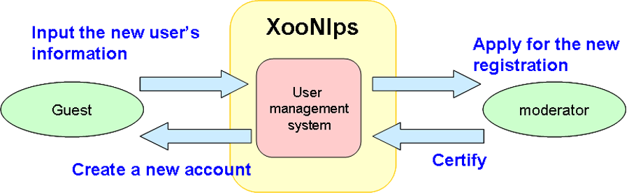
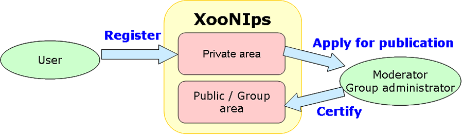

### 2.3.�Quality-maintenance workflow {#2-3-quality-maintenance-workflow}

#### 2.3.1.�Certification system for new user registrations {#2-3-1-certification-system-for-new-user-registrations}

To obtain a new account, the requester has to be checked / identified by the moderator to decide whether or not to certify the user as a registered user.

To prevent from malicious users.

**Figure�1.4.�User registration**

#### 2.3.2.�Item peer-review system {#2-3-2-item-peer-review-system}

The items to be registered and shared in the public and a group area have to be peer-reviewed by the moderator or group administrator. (Optional)

To manage quality control

**Figure�1.5.�peer-review system**