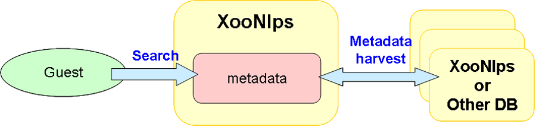

### 2.4. Metadata distribution {#2-4-metadata-distribution}

#### 2.4.1. Simultaneous search across different external database sites {#2-4-1-simultaneous-search-across-different-external-database-sites}

*   Enable to obtain metadata complying with OAI-PMH

    *   Mounted repository and harvester.

    *   Metadata format

        *   Apply to OAI-DC,JUNII,JUNII2

**Figure 1.6. Metadata distribution**