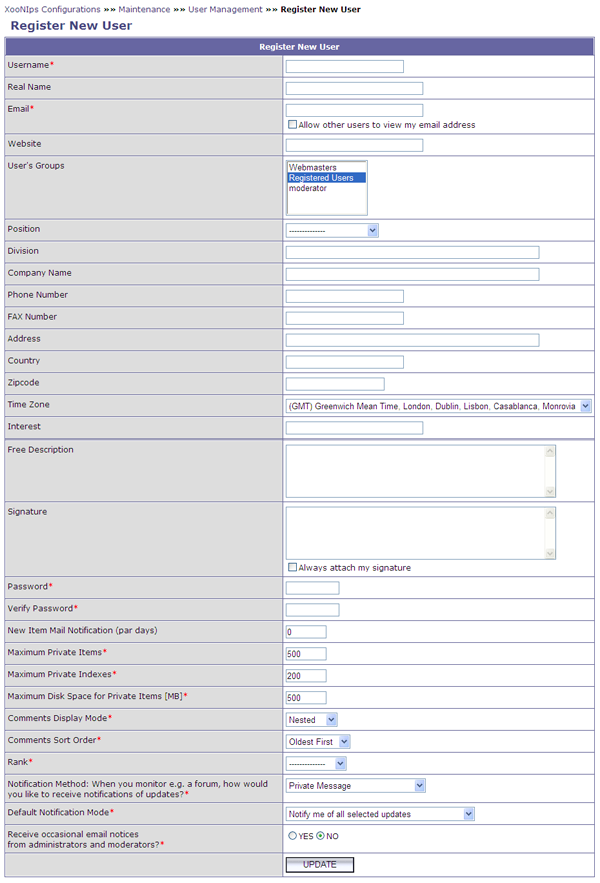

### 2.2. &quot;User Management&quot; (XooNIps&gt;&gt;Maintenance&gt;&gt;User Management) {#2-2-user-management-xoonips-maintenance-user-management}

How to manage user information (editing/deleting user information, registering new users, etc.).

**Figure 4.17. &quot;User Management&quot;**

Click on a pen-icon to edit user information.

Click on a X-icon to delete user information.

#### 2.2.1. &quot;Register New user&quot; (click on [Register New User], upper right of the &quot;User Management&quot; screen). {#2-2-1-register-new-user-click-on-register-new-user-upper-right-of-the-user-management-screen}

Edit the new user&#039;s information. The required fields are indicated by &quot;*&quot;. Fill out the fields and click on [UPDATE] below.

Use this screen for changing passwords.

The required fields vary with the setups made on (XooNIps - Site Policies -) User Information.

*   Username

    Enter a handle (online name) of the user to be displayed on XooNIps

*   Real Name

    Enter the user&#039;s real name

*   Email

    Enter email address. Check the checkbox if allow other users to view the email address.

*   Website

    Enter the URL to be published.

*   User&#039;s Groups

    Choose a XOOPS group which the user belongs to.

    **Table 4.8. &quot;User&#039;s Groups&quot;**

    | Pulldown menu | Description |
    | :-- | :-- |
    | Webmasters | Make the user belong to the webmasters group as XOOPS indicates. |
    | Registered User | Make the user belong to the registered users group as XOOPS indicates. |
    | Moderator | Make the user belong to the moderator group of XooNIps. |

*   Position

    Choose the user&#039;s position from the pulldown list.

*   Division

    Enter the division the user belongs to.

*   Company Name

    Enter the company/university/institution name the user belongs to.

*   Phone Number

    Enter the telephone number if wish to publish it.

*   FAX Number

    Enter the fax number if wish to publish it.

*   Address

    Enter the address if wish to publish it.

*   Country

    Enter the country where the user live.

*   Zipcode

    Enter the ZIP code, if wish to publish it.

*   Time zone

    Choose a time zone according to the user&#039;s country.

*   Interests

    Enter the user&#039;s interests, if wish to publish it.

*   Free Description

    Describe anything you want.

*   Signature

    Enter the user&#039;s signature. Check/uncheck the checkbox &quot;Always attach my signature&quot;.

*   Password

    Register a password.

*   Verify Password

    Enter the password again to confirm it.

*   New Item Mail Notification [per day]

    Set the frequency of email notification by the day.:&quot; (Listed later in this section).

    This is applicable only if it&#039;s been set as &quot;Email (Pulldown menu)&quot; at &quot;Notification Method:&quot; (Listed later in this section).

*   Maximum Private Items

    Enter the maximum number of items to be registered in a private area.

    Default value: 500

*   Maximum Private Indexes

    Enter the maximum number of indexes for a private area.

    Default value: 200

*   Maximum Disk Space for Private Items [MB]

    Enter the maximum disk capacity for a private area by the MB.

    Default value: 500

*   Comment Display Mode

    Choose a comment display mode from the pulldown menu.

    This is for XOOPS standard comment function. Note that this is not for adding comments to the items on XooNIps3.4.

    **Table 4.9. Comment Display Mode**

    | Comment Display Mode (Pulldown) | Description |
    | :-- | :-- |
    | Nested | Comments will be nest-displayed. |
    | Flat | Comments will be flat-displayed. |
    | Threaded | Comments will be sorted by groups according to the title. |

*   Comments Sort Order

    Choose either of &quot;Oldest First&quot; or &quot;Newest First&quot; from the pulldown menu.

    **Table 4.10. Comments Sort Order**

    | Pulldown menu | Description |
    | :-- | :-- |
    | Oldest First | Comments will be sorted out from the oldest to the newest. |
    | Newest First | Comments will be sorted out from the newest to the oldest. |

*   Rank

    Setup for ranking

    Leave it as it is.

*   Notification Method: When you monitor e.g. a forum, how would you like to receive notifications of updates?

    Define a manner of receiving notification messages of updated events.

    **Table 4.11. Notification Method**

    | Pulldown menu | Comment |
    | :-- | :-- |
    | Temporarily Disable | Temporarily stop receiving the messages. |
    | Private Message | via PM function of XOOPS. |
    | Email (use address in my profile) | via the registered email address. |

*   Default Notification Mode

    Define the timing for being notified.

    **Table 4.12. Default Notification**

    | Pulldown menu | Comment |
    | :-- | :-- |
    | Notify me of all selected updates | To be notified every time events are updated. |
    | Notice me only once | To be notified only once |
    | Notify me once then disable until I log in again. | Once it notifies, it won&#039;t notify until it is logged in again. |

*   Receive occasional email notices from administrators and moderators?

    Choose &quot;Yes&quot;, if wish to receive email messages about news update on XooNIps.

**Figure 4.18. &quot;Register New User&quot;**

The entered information can be viewed at the &quot;User Information&quot; (on a XooNIps website, User Menu &gt;&gt; User List).