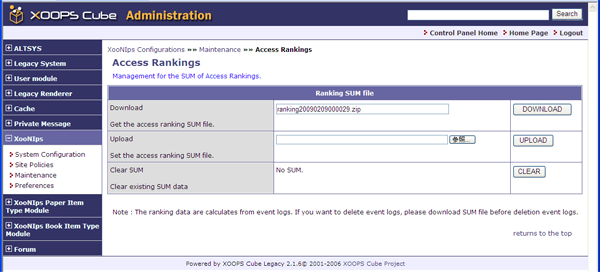

### 2.5.�&quot;Access Rankings&quot; (XooNIps&gt;&gt;Maintenance&gt;&gt;Access Rankings) {#2-5-access-rankings-xoonips-maintenance-access-rankings}

The sum of access ranking will automatically be generated from the event-log.

This function allows to perform &quot;Download&quot;, &quot;Upload&quot;, &quot;Clear SUM (reset the value)&quot;.

By uploading the ranking files, the sum of access rankings can be taken over even if the site will be moved.

**Figure�4.27.�&quot;Access Rankings&quot;**