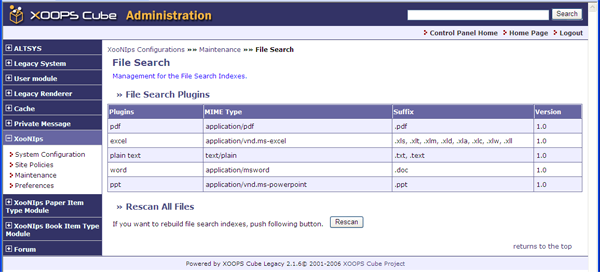

### 2.6. &quot;File Search&quot; (XooNIps&gt;&gt;Maintenance&gt;&gt;File Search) {#2-6-file-search-xoonips-maintenance-file-search}

Management for the file search indexes:

*   &quot;File Search Plugins&quot;

    Display the list of available file search plugins.

*   &quot;Rescan All Files&quot;

    Click on [Rescan] when the version of a plugin is updated and it is necessary to rebuild the file search indexes.

**Figure 4.28. &quot;File Search&quot;**